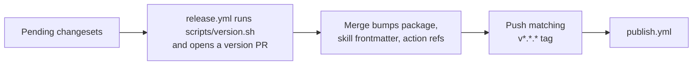

# Contributing

agentlint is a personal open-source project maintained by Aurelien Bobenrieth. **Issues and discussions are welcome** for bug reports, questions, and design feedback. **Code contributions and pull requests are not currently accepted.**

What follows is the maintainer workflow. Invariants live in [`AGENTS.md`](AGENTS.md); their reasons in [`docs/decisions/`](docs/decisions/README.md).

## Setup

Node 22.19+ and pnpm 10+ (Corepack picks the declared pnpm). Point your editor at the workspace TypeScript so the Effect language service plugin loads.

```bash
pnpm install
pnpm build      # CLI, declarations, review UI (dist/ui), grammar WASM (dist/wasm)
pnpm check      # architecture, typecheck (sources and tests), oxlint, oxfmt, knip,
                # skill validation, action smoke test, tests, coverage

pnpm test:watch                      # package tests in watch mode
pnpm --filter @agentlint/review dev  # review SPA against a running `agentlint review --port 4973`
pnpm fmt                             # format everything
pnpm refs:sync                       # refresh the reference clones under .agents/ref-repos
```

## Maintainer rules

1. Keep parsing, Git evidence, persistence, application handlers, CLI formatting, and the browser UI apart. A feature is `packages/agentlint/src/features/<name>/` with a `request.ts` and a `handler.ts`.
2. Effect services for infrastructure; Effect Schema for anything public or persisted.
3. Product rules live in consumer repositories or rule packages, never in the core.
4. Acceptance compatibility is gate-critical: changes to source identity, fingerprints, authority, lineage, or cleanup need tests.
5. Anything a user can notice (public API, CLI, persisted data, dependencies, packaged skills) needs a changeset: `pnpm changeset`. Use conventional commit prefixes.
6. Run `pnpm fmt` and `pnpm check` before opening the pull request.

## Smoke-test the tarball after dependency, build, or CLI-entry changes

CI packs the tarball and installs it in an empty project. Locally:

```bash
pnpm --filter @aurelienbbn/agentlint pack --pack-destination /tmp
node scripts/smoke-package.mjs /tmp/aurelienbbn-agentlint-*.tgz
```

## Releasing



`publish.yml` rejects a tag that doesn't match the package version or isn't on `main`, then rebuilds, checks, smoke-tests, publishes with provenance, and creates the GitHub release.

Publishing uses npm trusted publishing, with no token. The package's trusted publisher on npmjs.com must name repository `aurelienbobenrieth/agentlint`, workflow `publish.yml`, and environment `npm`; any mismatch fails the publish step after validation has passed.

## Writing rules

One `defineRule` composes a revisioned `standard`, a versioned `detector`, and a repository `binding` ([guide](docs/guide/writing-rules.md)). Fixtures are proof samples, not a catalogue of mistakes. Before enabling a binding, run `agentlint rules test` and calibrate with `agentlint rules scan --review`.
