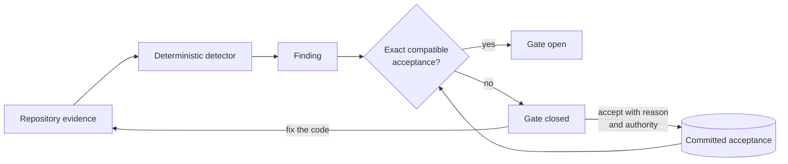

# agentlint

[](https://github.com/aurelienbobenrieth/agentlint/actions/workflows/ci.yml)
[](https://www.npmjs.com/package/@aurelienbbn/agentlint)
[](LICENSE)

**Deterministic findings and explicit judgment gates for coding agents.**

Linters catch what is mechanically wrong; prompts only ask agents to remember. agentlint gates the judgment in between: it flags code that needs a decision, shows your standard, and stays closed until the evidence changes or someone with enough authority accepts it.



An acceptance is a committed `eslint-disable` that needs a reason, an authority, and a fresh review when the code moves. No model, no bundled rules, no required agent harness: your repository owns every standard.

## Six ideas carry the model

Agents usually get the mechanics right. The risk is the unasked question: _is this retry safe, is this migration reversible, should a human see this?_

| Idea             | Meaning                                                                                                                              |
| ---------------- | ------------------------------------------------------------------------------------------------------------------------------------ |
| **State rule**   | Judges current source: `db.users.findMany()` without a bound.                                                                        |
| **Change rule**  | Judges the Git change since the merge base: a dropped table, a widened role.                                                         |
| **Authority**    | Who may close the gate. An agent may accept a bounded query with a concrete reason; only a human may accept a destructive migration. |
| **Fingerprint**  | Keeps an acceptance through formatting and line moves; invalidates it on a material code change.                                     |
| **Review epoch** | Lets the repository deliberately expire otherwise compatible decisions. The engine reads no clock.                                   |
| **Outcome**      | Attaches later corrections, rollbacks, incidents, useful interceptions, or unnecessary reviews to the finding.                       |

## Four commands to a working gate

```bash
pnpm add -D @aurelienbbn/agentlint
pnpm agentlint init          # creates .agentlint/config.ts
pnpm agentlint rules test    # proves each detector against its fixtures
pnpm agentlint check --all   # runs the gate
```

Or have your coding agent install the package and follow its `setup` skill: it helps turn the standards your repository already enforces into rules, calibrates before enforcing, and installs the Claude Code or Codex hook so a finished turn means an open gate.

## A rule is standard + detector + binding

```ts
import { defineConfig, defineRule } from "@aurelienbbn/agentlint";

const boundedReads = defineRule({
  lifecycle: "state",
  standard: {
    // what good looks like
    id: "data/bounded-reads",
    revision: 1,
    title: "Production reads are bounded",
    guidance: "Reads that scale with production data have an explicit bound or pagination contract.",
  },
  detector: {
    // where to look, proven by fixtures
    id: "prisma/find-many-without-take",
    version: 1,
    match: { pattern: "$DB.findMany($$$ARGS)", where: { notHas: "take: $_" }, message: "$DB has no bound." },
    fixtures: { mustReport: ["db.users.findMany({})"], mustStaySilent: ["db.users.findMany({ take: 50 })"] },
  },
  // who may accept, and which files
  binding: { id: "data/bounded-reads", authority: "agent", include: ["src/**/*.ts"] },
});

export default defineConfig({ rules: [boundedReads] });
```

## A closed gate ends in a fix or a recorded reason

```bash
pnpm agentlint explain 1
pnpm agentlint accept 1 --reason "The route caps every request at 100 rows."
```

Findings that need a human go where the human works:

- **Locally:** `pnpm agentlint review` opens a keyboard-first workspace with the code, the standard, and the agent's proposal side by side.
- **On the pull request:** the [GitHub action](action/README.md) opens one thread per finding; `/agentlint approve` records human authority in place.

Next: the [package README](packages/agentlint/README.md) for the overview, the [guide](docs/guide/README.md) for the full model, the [demo](examples/demo/README.md) for the whole loop, the [decision records](docs/decisions/README.md) for the why.

## Workspace

| Path                 | Purpose                                                                     |
| -------------------- | --------------------------------------------------------------------------- |
| `packages/agentlint` | The published package: CLI, engine, rule API, packaged review UI, skills.   |
| `apps/review`        | FoldKit single-page review application, built into the package.             |
| `examples/demo`      | A small commerce app with seven rules that exercise every part of the loop. |
| `examples/minimal`   | The smallest consumer: one dependency, one rule, one source file.           |
| `docs/guide`         | User guide: rules, acceptance, review, CI, CLI, API, guarantees.            |
| `docs/decisions`     | Product and architecture decision records.                                  |
| `action`             | Reusable GitHub action: check run, review threads, `/agentlint approve`.    |

## Contributing

See [`CONTRIBUTING.md`](CONTRIBUTING.md). Agents working on this repository read [`AGENTS.md`](AGENTS.md) first.

## License

[MIT](LICENSE)
