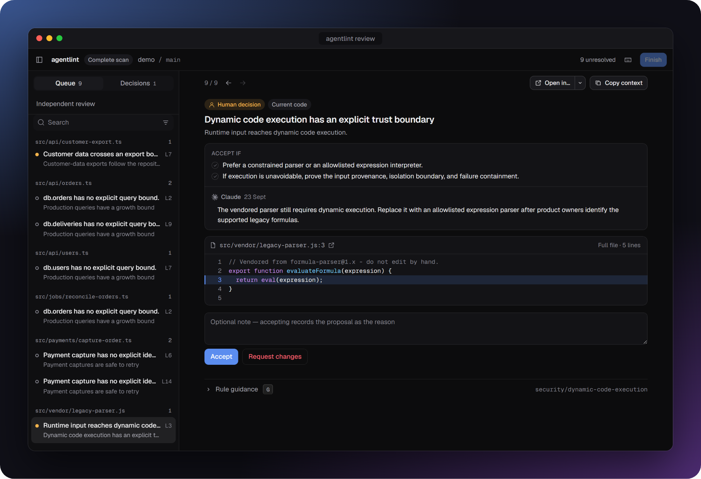
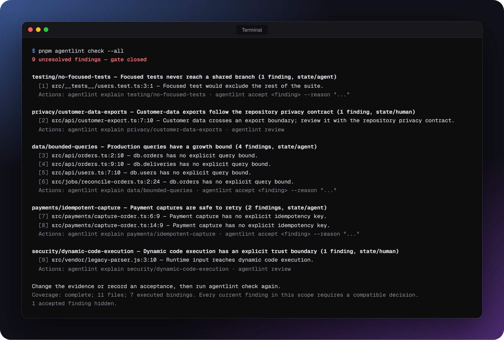
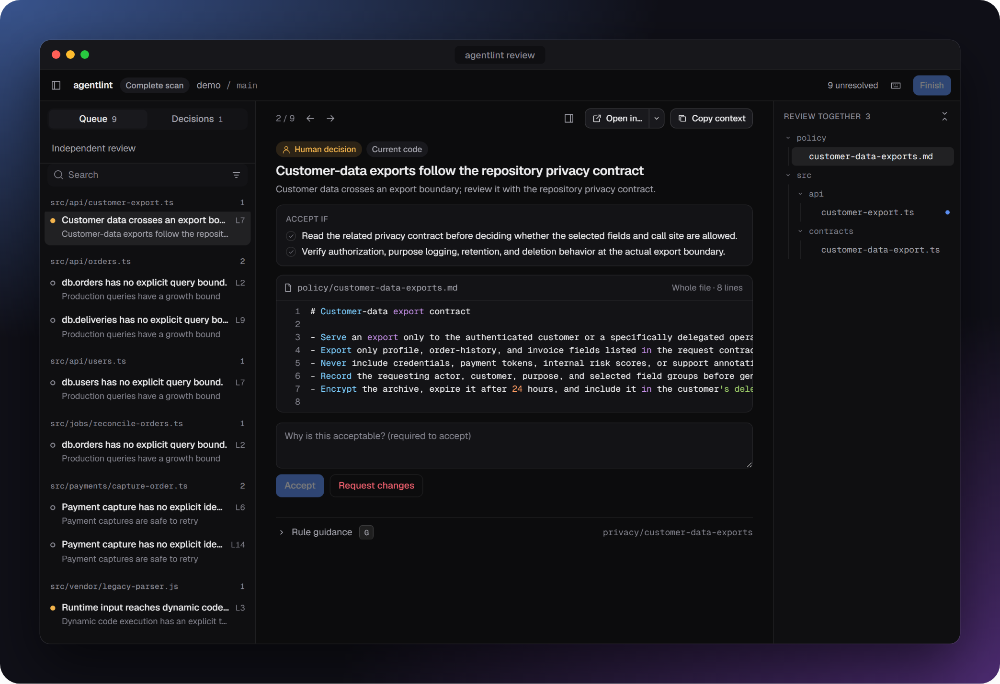
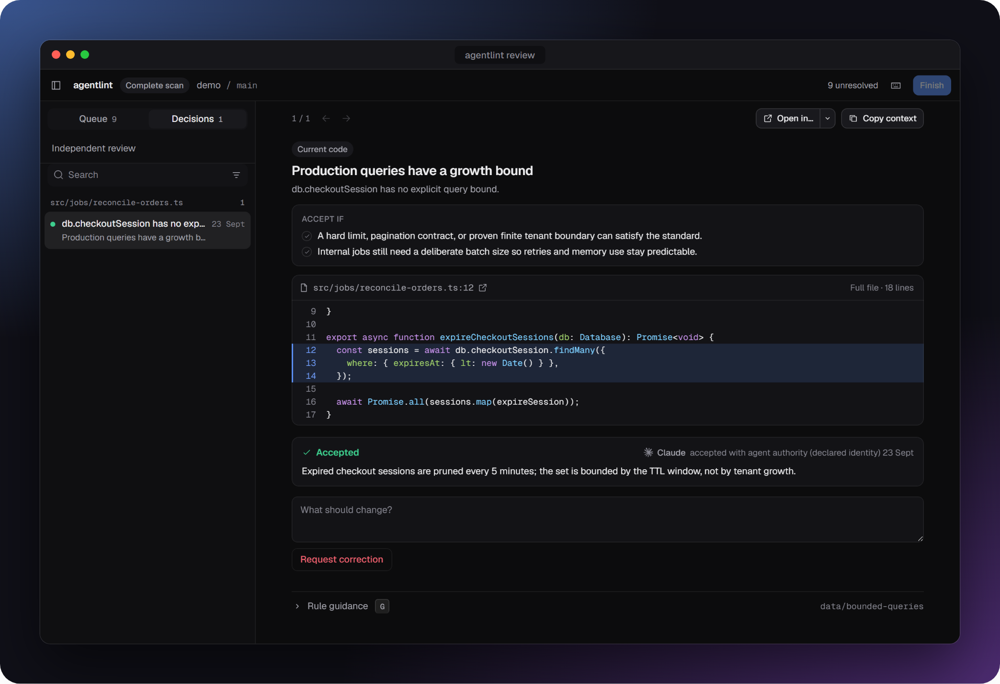

<div align="center">

<h1>agentlint</h1>

<p><strong>Your <code>AGENTS.md</code> rules are followed most of the time.<br />agentlint turns the important ones into a gate and keeps a committed record of every exception.</strong></p>

[](https://github.com/aurelienbobenrieth/agentlint/actions/workflows/ci.yml)
[](https://www.npmjs.com/package/@aurelienbbn/agentlint)
[](LICENSE)

[Get started](docs/guide/getting-started.md) · [Try the demo](examples/demo/README.md) · [Guide](docs/guide/README.md) · [Why it works this way](docs/decisions/README.md)

<br />



</div>

## Agents slip on judgment, not syntax

A payment call without an idempotency key. A dropped column without a backfill. An unbounded read that was fine in the fixture. Each one passes the tests.

| Tool          | With a judgment call                            |
| ------------- | ----------------------------------------------- |
| Prompt        | Asks the agent to remember                      |
| Linter        | Can only say "always wrong"                     |
| AI reviewer   | Says something different on every run           |
| Tired human   | Approves a big diff because the tests are green |
| **agentlint** | Blocks until someone records a reason           |

agentlint flags the code shape, shows your standard next to it, and stays closed until the code changes or someone with enough authority accepts it. No model, no network, no clock: the same repository gives the same findings, locally and in CI.

## The gate closes the agent's turn



Run it as a Claude Code or Codex `Stop` hook and as a required CI check. The agent fixes the code or records why it is acceptable, if its authority allows. Exit codes are `0` open, `1` closed, `2` broken.

## Humans decide with the policy beside the code



`pnpm agentlint review` opens a keyboard-first local UI. Each finding shows what to check before accepting, the agent's proposal, the code or diff, and the files to read with it. On a pull request, the [GitHub action](action/README.md) opens one thread per finding and `/agentlint approve` records human authority in place.

## Every exception is a reviewable record



An acceptance carries a reason, an actor, and the authority the rule requires (`agent` or `human`). It lives in `.agentlint/acceptances.jsonl`, shows in the PR diff, and expires when the code materially changes: an `eslint-disable` that needs a reason, an authority, and a new review when the code moves.

> An open gate means every current finding in the scan scope has a compatible recorded decision. It doesn't prove the judgment was right, or that unconfigured concerns were reviewed.

## Four commands to a working gate

```bash
pnpm add -D @aurelienbbn/agentlint
pnpm agentlint init          # creates .agentlint/config.ts
pnpm agentlint rules test    # proves each detector against its fixtures
pnpm agentlint check --all   # runs the gate
```

Or have your coding agent install the package and follow its `setup` skill: it turns the standards your repository already enforces into rules, calibrates before enforcing, and installs the hook so a finished turn means an open gate.

agentlint ships no rules. Your repository owns every standard, detector, and binding.

## A rule is standard + detector + binding

```ts
import { defineConfig, defineRule } from "@aurelienbbn/agentlint";

const boundedReads = defineRule({
  lifecycle: "state",
  standard: {
    // what good looks like
    id: "data/bounded-reads",
    revision: 1,
    title: "Production reads are bounded",
    guidance: "Reads that scale with production data have an explicit bound or pagination contract.",
  },
  detector: {
    // where to look, proven by fixtures
    id: "prisma/find-many-without-take",
    version: 1,
    match: { pattern: "$DB.findMany($$$ARGS)", where: { notHas: "take: $_" }, message: "$DB has no bound." },
    fixtures: { mustReport: ["db.users.findMany({})"], mustStaySilent: ["db.users.findMany({ take: 50 })"] },
  },
  // who may accept, and which files
  binding: { id: "data/bounded-reads", authority: "agent", include: ["src/**/*.ts"] },
});

export default defineConfig({ rules: [boundedReads] });
```

A `state` rule judges current source. A `change` rule judges the Git diff since the merge base: a dropped table, a widened role.

<details>
<summary><strong>The rest of the model in six ideas</strong></summary>

| Idea             | Meaning                                                                                                                              |
| ---------------- | ------------------------------------------------------------------------------------------------------------------------------------ |
| **State rule**   | Judges current source: `db.users.findMany()` without a bound.                                                                        |
| **Change rule**  | Judges the Git change since the merge base: a dropped table, a widened role.                                                         |
| **Authority**    | Who may close the gate. An agent may accept a bounded query with a concrete reason; only a human may accept a destructive migration. |
| **Fingerprint**  | Keeps an acceptance through formatting and line moves; invalidates it on a material code change.                                     |
| **Review epoch** | Lets the repository deliberately expire otherwise compatible decisions. The engine reads no clock.                                   |
| **Outcome**      | Attaches later corrections, rollbacks, incidents, useful interceptions, or unnecessary reviews to the finding.                       |

</details>

## Where to go next

| Goal                                   | Read                                                                                     |
| -------------------------------------- | ---------------------------------------------------------------------------------------- |
| See the whole loop on a sample app     | [Demo](examples/demo/README.md)                                                          |
| Turn a repeated correction into a rule | [Get started](docs/guide/getting-started.md), [Write rules](docs/guide/writing-rules.md) |
| Close findings as an agent or a human  | [Acceptance](docs/guide/acceptance.md), [Review](docs/guide/review.md)                   |
| Gate pull requests and agent turns     | [CI and hooks](docs/guide/ci.md)                                                         |
| Know exactly what the gate guarantees  | [Guarantees](docs/guide/guarantees.md)                                                   |
| Understand a design choice             | [Decision records](docs/decisions/README.md)                                             |

## Workspace

| Path                 | Purpose                                                                     |
| -------------------- | --------------------------------------------------------------------------- |
| `packages/agentlint` | The published package: CLI, engine, rule API, packaged review UI, skills.   |
| `apps/review`        | FoldKit single-page review application, built into the package.             |
| `examples/demo`      | A small commerce app with seven rules that exercise every part of the loop. |
| `examples/minimal`   | The smallest consumer: one dependency, one rule, one source file.           |
| `docs/guide`         | User guide: rules, acceptance, review, CI, CLI, API, guarantees.            |
| `docs/decisions`     | Product and architecture decision records.                                  |
| `action`             | Reusable GitHub action: check run, review threads, `/agentlint approve`.    |

The screenshots come from the demo: `pnpm build && pnpm --filter @agentlint/review readme:assets` regenerates them.

## Contributing

See [`CONTRIBUTING.md`](CONTRIBUTING.md). Agents working on this repository read [`AGENTS.md`](AGENTS.md) first.

## License

[MIT](LICENSE)
