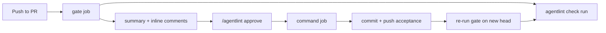
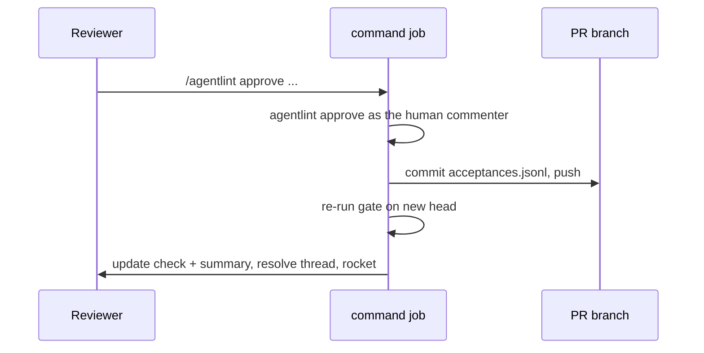

# agentlint GitHub Action

Runs the [agentlint](../packages/agentlint/README.md) gate on pull requests; reviewers approve findings from a comment.



| Surface                   | Behavior                                                                                                        |
| ------------------------- | --------------------------------------------------------------------------------------------------------------- |
| Check run **`agentlint`** | The gate on the head commit: `success`, `failure`, or `action_required`. One annotation per unresolved finding. |
| Summary comment           | One per pull request, edited in place each run.                                                                 |
| Inline comments           | One per finding inside the diff; resolved once the finding is accepted or disappears.                           |
| `/agentlint approve ...`  | Records a human acceptance, commits it as the approver, pushes, re-runs the gate.                               |

A composite action: dependency-free Node scripts, global `fetch`, and `git`. The CLI runs through `npx` at your pinned version, or from a checkout you built.

## Setup: two jobs, two permission sets

```yaml
name: agentlint

on:
  pull_request:
    types: [opened, synchronize, reopened, ready_for_review]
  issue_comment:
    types: [created]
  pull_request_review_comment:
    types: [created]

permissions: {}

jobs:
  gate:
    if: github.event_name == 'pull_request'
    runs-on: ubuntu-latest
    permissions:
      contents: read
      pull-requests: write
      checks: write
    steps:
      - name: Checkout pull request
        uses: actions/checkout@v5
        with:
          fetch-depth: 0
          persist-credentials: false
      - name: Set up Node
        uses: actions/setup-node@v5
        with:
          node-version: 22
      - name: Run the agentlint gate
        uses: aurelienbobenrieth/agentlint/action@v0.2.0
        with:
          version: "0.2.0"

  command:
    if: >-
      (github.event_name == 'issue_comment' && github.event.issue.pull_request && startsWith(github.event.comment.body, '/agentlint'))
      || (github.event_name == 'pull_request_review_comment' && startsWith(github.event.comment.body, '/agentlint'))
    # On the job, behind the `if`: a comment that is not a command never enters the group.
    concurrency:
      group: agentlint-command-${{ github.event.issue.number || github.event.pull_request.number }}
      cancel-in-progress: false
    runs-on: ubuntu-latest
    permissions:
      contents: write
      pull-requests: write
      checks: write
    steps:
      - name: Checkout command target
        uses: actions/checkout@v5
        with:
          fetch-depth: 0
          persist-credentials: false
      - name: Set up command runtime
        uses: actions/setup-node@v5
        with:
          node-version: 22
      - name: Apply the agentlint command
        uses: aurelienbobenrieth/agentlint/action@v0.2.0
        with:
          version: "0.2.0"
```

- `fetch-depth: 0`: change rules diff against the merge base with `origin/<base>`.
- **Mark the `agentlint` check as required** on the base branch (protection rules or ruleset). The check run is the gate, not the workflow conclusion. Accepting forks? Read [Fork pull requests](#fork-pull-requests) first.

### Credentials stay out of repository code

The install and CLI execute repository code (lifecycle scripts, `.agentlint/config.ts`).

| Process                                   | Gets the token?                                                                                                                                                 |
| ----------------------------------------- | --------------------------------------------------------------------------------------------------------------------------------------------------------------- |
| The action's own GitHub API calls         | Yes                                                                                                                                                             |
| `git fetch` and the approval `git push`   | Yes, as an HTTP header on that one command, never in `.git/config`                                                                                              |
| Install, agentlint CLI, every other `git` | No. Started without `github-token`, `GITHUB_TOKEN`, `GH_TOKEN`, the `ACTIONS_*` runtime and OIDC variables, `NODE_AUTH_TOKEN`, `NPM_TOKEN`, and every `INPUT_*` |

> [!WARNING]
> Only those names are removed. Put no other secrets in these jobs' `env`.

### Concurrency saves runner time, not correctness

A concurrency group holds one running and one pending run; a newer pending run cancels the older one. At workflow level every comment enters, so three quick approvals leave one cancelled. On the `command` job, only commands enter, but a burst of more than two can still drop the middle ones: no rocket reaction, the commenter resends. Remove the `concurrency` block if that matters more than runner time.

Correctness never depends on it: if the branch moved between fetch and push, the action refetches, re-records the approval on the new head, and pushes again, up to three times, never with force.

## Inputs

| Input               | Default                  | Meaning                                                                                                                                                                                                                                                   |
| ------------------- | ------------------------ | --------------------------------------------------------------------------------------------------------------------------------------------------------------------------------------------------------------------------------------------------------- |
| `version`           | `0.2.0`                  | `@aurelienbbn/agentlint` version for `npx --yes`, or `file:<path>` to run `<path>/dist/bin.mjs` from a built checkout (relative to the workspace root). A copy installed by the repository (`install: true`) wins, with a warning if its version differs. |
| `base`              | `${{ github.base_ref }}` | Base branch, slashes allowed (`release/1.x`). Passed to `--base` as `origin/<base>`, fetched if missing. `HEAD`, `origin/...`, `refs/...` pass through.                                                                                                   |
| `working-directory` | `.`                      | Directory holding `.agentlint/config.ts`.                                                                                                                                                                                                                 |
| `install`           | `false`                  | Install first, by lockfile (working directory, then workspace): `pnpm install --frozen-lockfile`, `bun install --frozen-lockfile`, `yarn install --immutable`, or `npm ci`.                                                                               |
| `github-token`      | `${{ github.token }}`    | For the check run, comments, fetches, and approval push. See [The approval push](#the-approval-push).                                                                                                                                                     |
| `comment`           | `true`                   | Post the summary and inline comments. `false` keeps only the check run.                                                                                                                                                                                   |
| `dry-run`           | `false`                  | Read everything, write nothing; planned writes are printed and returned in `dry-run-plan`.                                                                                                                                                                |

## Outputs and exit codes

| Output         | Meaning                                                                                                                                     |
| -------------- | ------------------------------------------------------------------------------------------------------------------------------------------- |
| `gate`         | `open`, `closed`, or `error` (CLI exit 0, 1, 2)                                                                                             |
| `unresolved`   | Unresolved findings                                                                                                                         |
| `human`        | Unresolved findings needing human authority                                                                                                 |
| `artifact`     | Absolute path of the detached review artifact, uploaded as `agentlint-review-<pr>` (30-day retention). Open with `agentlint review --from`. |
| `dry-run-plan` | JSON array of `{ method, url, body }`, one per write a dry run skipped                                                                      |

On `pull_request` the step exits with the gate code, so the job fails while the gate is closed. Command runs exit 0 once the command is answered, refusals included, and non-zero when the action failed or the approval could not be pushed.

## Commands

| Where                                | Command                                                                                                                                    |
| ------------------------------------ | ------------------------------------------------------------------------------------------------------------------------------------------ |
| Pull request conversation            | `/agentlint approve <digest> --reason "why it satisfies the standard"`: `<digest>` is 7+ hex characters of the fingerprint, or `path:line` |
| Reply to an agentlint inline comment | `/agentlint approve <reason>`: approves the thread's finding                                                                               |
| Anywhere on the pull request         | `/agentlint check`: re-runs the gate                                                                                                       |

| Commenter                                 | Result                                     |
| ----------------------------------------- | ------------------------------------------ |
| User with `write`, `maintain`, or `admin` | Runs                                       |
| User without write access                 | Thumbs-down reaction and a reply           |
| Bot or other non-user account             | Ignored                                    |
| Anyone, on a fork pull request            | Refused: the token cannot push to the fork |

### An approval commits as the approver



- CLI env: `AGENTLINT_ACTOR=human:<login>`. Commits `.agentlint/acceptances.jsonl`.
- Author: the approver. Committer: `github-actions[bot]`. Subject `chore(agentlint): accept <rule> at <file>:<line>`, trailer `Approved-by: @<login>`.
- Reasons are truncated to 1000 characters.
- The action never accepts for an agent. Agent-authority findings are accepted locally with `agentlint accept` and pushed.

### Approve by digest; `path:line` goes stale

A digest, or a reply in an inline thread, names one finding and its evidence. `path:line` names whatever is on that line when the queued job runs, so it works only while the head is still the commit in the `Head` of the action's latest summary. After a push in between, it is refused and the reply asks for the digest.

Markers and summaries count only from comments by the token's own account (`github-actions[bot]` by default). A marker quoted by anyone else, another bot included, is ignored.

### The approval push

The push uses `github-token`, which needs `contents: write`.

> [!WARNING]
> With the default `GITHUB_TOKEN`, GitHub starts no workflows for the pushed commit. The `command` job still publishes the `agentlint` check there, but **other required checks never run** and the pull request waits for another push. If the base branch requires other checks, pass a GitHub App installation token or a fine-grained PAT; comments and the check run are then posted by that account.

A failed push records nothing and fails the run:

- **Refused** (branch rules, no `contents: write`): the reply quotes Git's message.
- **Branch moved three times**: the reply asks to resend the command.

## Fork pull requests

**A fork pull request never gets the `agentlint` check run.** Fork `pull_request` runs get a read-only token, so no check run or comment. The action still runs the gate, uploads the artifact, prints findings as workflow annotations (`::error` human, `::warning` agent), notes this in the log and step summary, and exits with the gate code. `/agentlint` commands are refused.

With the `agentlint` check required:

- A fork pull request cannot merge as is: the check never reports.
- **Do not require the `gate` job's status instead.** On a fork it comes from the fork's own `.agentlint/config.ts` and `.agentlint/acceptances.jsonl`; the contributor can delete a binding or add an acceptance to turn it green. It informs, it does not gate.
- `pull_request_target` is no workaround: the action rejects it, since it would run the fork's configuration with a write token.

**Supported path:** a maintainer reviews the fork's commits, including `.agentlint/` changes, pushes them to a branch here, and opens the pull request from it. The normal flow applies.

```sh
gh pr checkout <number>
git push origin HEAD:refs/heads/<branch>
```

## Test an unpublished build with a dry run

`dry-run: true` does every read and records every write, so read permissions suffice. Pair it with `file:`:

```yaml
- run: pnpm install --frozen-lockfile && pnpm build
- uses: ./action
  id: smoke
  with:
    working-directory: examples/demo
    version: file:packages/agentlint
    dry-run: "true"
  continue-on-error: true
- run: test "$GATE" = closed
  env:
    GATE: ${{ steps.smoke.outputs.gate }}
```

Full example: [`.github/workflows/action-smoke.yml`](../.github/workflows/action-smoke.yml).

## Limits and security

| Limit        | Value                                                                                                                                                              |
| ------------ | ------------------------------------------------------------------------------------------------------------------------------------------------------------------ |
| HTTP request | 30 s deadline                                                                                                                                                      |
| Subprocess   | 5 min deadline                                                                                                                                                     |
| Pagination   | REST and review threads: repeated cursors or pages rejected, error above 1,000 pages. REST must stay on the API origin. Never returns a partial result as success. |

Checking a repository executes its configuration and detectors:

- `pull_request_target` is rejected.
- Untrusted pull requests need an isolated runner with no secrets or write token. A privileged follow-up job must not execute untrusted code.
- The `command` job runs same-repository branches (a bot's, an agent's) with `contents: write`. Hence the credential scrubbing above, and no other secret in that job.
- Detached artifacts contain full source files with findings and review reasons. Restrict their audience and retention like the repository's.

See [the security model](../docs/security-model.md).
