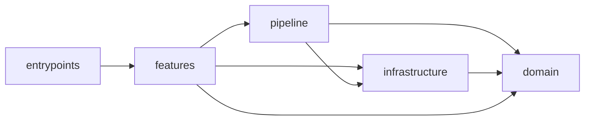

# Architecture

A module's path says which way its imports may point: ownership first, role second.

```text
packages/agentlint/src/
├── domain/                  value contracts, pure domain behavior
├── shared/pipeline/         coordinates detection, no product features
├── shared/infrastructure/   process, filesystem, Git, persistence adapters
└── features/<name>/         one use case: request, handler, tests
apps/review/src/
├── features/<name>/         one review UI capability
└── shared/
action/src/                  standalone composite Action
```

## Imports point toward the domain



## `pnpm architecture:check` rejects

- any import cycle in the production graph;
- `domain/` importing outside `domain/`;
- `shared/` importing a feature, or `apps/review/src/shared/` importing a review feature;
- `shared/infrastructure/` importing `shared/pipeline/`;
- the browser-safe review contract (`features/review/contract.ts`) importing any package but `effect`;
- `action/src/` importing anything at runtime but local modules and `node:` built-ins;
- an untagged `new Error(` in `packages/agentlint/src/`.

## `pnpm architecture:graph` regenerates the real graph

It writes [dependencies.mmd](./dependencies.mmd), a generated area-level Mermaid graph; don't edit it by hand. It is coarse on purpose: file-level graphs hide boundaries in noise.

## Name concerns with folders, not dashes

Prefer a folder for a multi-part concern (`git/command.ts`, `git/service.ts`, `rule/context/model.ts`) over a dashed or dotted filename. Apply this when a concern is added or structurally refactored; a single cohesive leaf may stay one file.
