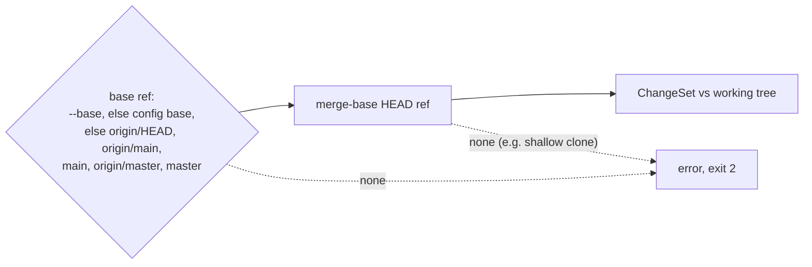

# ADR-001: Rule lifecycles

- Status: Accepted
- Date: 2026-08-10
- Depends on: [PDR-001](./pdr-001-product-core.md)
- Related to: [ADR-004](./adr-004-rule-composition.md), [ADR-005](./adr-005-fingerprints-and-lineage.md)

## Decision

**Each detector has one lifecycle, `state` or `change`. One standard can mix both, and the binding enables each detector on its own.**

AST matching, path selection, diffs, and repository inspection are detection capabilities, not lifecycles.

## Context

- The first engine only found AST nodes in current files.
- Some concerns exist only as a before-and-after relationship. Both kinds must fit without a general event system.
- The model must fix how long a finding and its acceptance live.

## Two questions, two lifetimes

|                    | `state`                                  | `change`                                                       |
| ------------------ | ---------------------------------------- | -------------------------------------------------------------- |
| Asks               | Does the condition exist now?            | Did this change make it?                                       |
| Examples           | unbounded query, unguarded auth route    | removed public export, added dependency, destructive migration |
| Detector           | `match` and/or `createOnce`              | `detect({ context, options })` over a `ChangeSet`              |
| Finding lives      | while the normalized evidence stays      | while the change exists. Git keeps the acceptance after merge  |
| `check` runs it on | changed files. `--all`: whole repository | every run                                                      |
| Fingerprint        | `source-structure`                       | `git-change`                                                   |

- A state scan covers the whole repository without `--all` when any active state rule has `createOnce` (unless `scan: "file"`), `scan: "repository"`, or binding `dependencies`.
- Change rules run every time because the final state may not hold enough evidence to find them again.

## Changes are diffs from a merge base



- The working tree side includes committed, staged, unstaged, and untracked content.
- `ChangeSet`: `baseline` (`ref`, `commit`) and one entry per file with `status`, `previousPath`, `before`/`after` snapshots, and `hunks`.

## Capabilities

| Capability     | State                                                    | Change                       |
| -------------- | -------------------------------------------------------- | ---------------------------- |
| File selection | binding `include`/`exclude`, config `ignores`            | same                         |
| Syntax         | `match`: exactly one of `pattern` or tree-sitter `query` | none. `detect` parses itself |
| Imperative     | `createOnce` escape hatch                                | `createOnce` is not allowed  |

```ts
createOnce({ context, options }) {       // once per rule, before any file
  return {
    before(path) {},                     // each file, absolute path. Return false to skip
    call_expression(node) {},            // any grammar node type
    after() {},                          // once. Findings are drained after it
  };
}
```

No separate text search. Prefer syntax when it is more precise.

## One standard or two

| Situation                                    | Model                                                                             |
| -------------------------------------------- | --------------------------------------------------------------------------------- |
| Detectors ask the same question              | One standard (e.g. destructive migration: dropped table, dropped column, raw SQL) |
| Adoption needs state, precision needs change | One standard, a state and a change detector                                       |
| Questions or guidance differ                 | Two standards                                                                     |
| One detector wants two lifecycles            | Not allowed                                                                       |

## One discriminated `defineRule`

```ts
defineRule({
  lifecycle: "change", // selects the detector and fixture contracts
  standard: { id: "api/public-exports", revision: 1, title: "...", guidance: { standard: "..." } },
  detector: { id: "ts/public-export-removed", version: 1, detect({ context }) {} },
  binding: { id: "api/public-exports", authority: "agent" },
});
```

- TypeScript overloads and runtime validation reject invalid combinations.
- Every finding is one `FindingRecord` (rule id, lifecycle, authority, source, fingerprint, optional lineage key, file, position, message, snippet, related files). No AST node required.

## Fixtures are regression evidence, not proof

- `mustReport` and `mustStaySilent`, run by `agentlint rules test`.
- State: a source string, a labeled source, or a small in-memory repository. Change: a `before`/`after` repository pair or an exact `ChangeSet`.
- A newly found missed case adds a fixture. Fixture code is never sent to the agent as guidance.

## Fingerprints ignore line numbers

| Scheme             | Digests                                                                                                 |
| ------------------ | ------------------------------------------------------------------------------------------------------- |
| `source-structure` | path, semantic structure of the file, declared dependency contents, optional `evidence`, occurrence key |
| `git-change`       | detector `evidence`, before and after paths, file operation, detector `key`                             |

The occurrence key is the node's structural child path or a unique detector `key`, so two equal conditions in one file differ. See [ADR-005](./adr-005-fingerprints-and-lineage.md).

## Consequences

| Gain                                                             | Cost                                       |
| ---------------------------------------------------------------- | ------------------------------------------ |
| Findings need no AST node.                                       | Two detector contracts and fixture shapes. |
| Lifecycle is separate from evaluation time. Run `check` anytime. | Change rules need a resolvable Git base.   |
| Fixtures cover source, repository, and before-and-after.         | Two fingerprint schemes to version.        |

## Rejected alternatives

| Option                                            | Why not                                                                                |
| ------------------------------------------------- | -------------------------------------------------------------------------------------- |
| AST as the rule type                              | Makes a capability the product boundary. Cannot express change-only concerns.          |
| Source/file/change/project/session/command scopes | Mixes evidence location, lifecycle, and evaluation time. Unclear acceptance lifetimes. |
| One general event rule                            | Flexible but unconstrained. Fixtures, fingerprints, and integrations get harder.       |
| Lifecycle on the standard                         | One question could not use both lifecycles. Couples policy to one detection strategy.  |

## Reconsider when

- A real concern needs a third acceptance lifetime.
- An integration needs a comparison other than a Git merge base.

<details>
<summary>Revision history</summary>

- 2026-08-10: Proposed and accepted. Separated fixtures from agent guidance and standards from detectors, moved lifecycle to the detector, adopted one discriminated `defineRule`, completed both pipelines for 0.2.
- 2026-08-28: Condensed and aligned with the 0.2 implementation.
- 2026-09-20: Aligned the `before` hook argument and the state fingerprint inputs with the implementation.
- 2026-09-23: Reformatted for scanning. Recorded when a state scan covers the whole repository, the base fallback order, and the one-of `pattern` or `query` rule. Decision unchanged.

</details>
