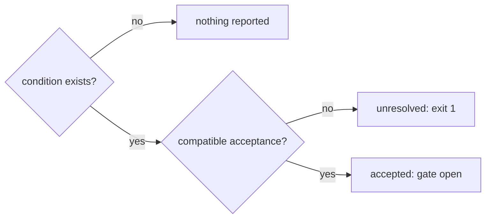

# ADR-002: Acceptance model

- Status: Accepted
- Date: 2026-08-10
- Depends on: [PDR-001](./pdr-001-product-core.md)
- Related to: [ADR-004](./adr-004-rule-composition.md), [ADR-005](./adr-005-fingerprints-and-lineage.md), [ADR-006](./adr-006-review-workflows.md)

## Decision

**A finding is `unresolved` or `accepted`, derived, never stored. `.agentlint/acceptances.jsonl` holds only current acceptances, and each binding requires `agent` or `human` authority.**

`acceptance` is the domain term for a stored result.

## Context

- The first 0.2 design had five dispositions and two persistence values. Most did not change the gate.
- Its append-only ledger grew with every event, and each check read all of it.
- Git already keeps old file versions.

## The gate is derived



- An acceptance says the evidence is permitted for a documented reason. It need not mean a violation: some rules mark a decision point that the evidence satisfies.
- No stored state is added unless it changes gate behavior.

## Human satisfies both policies

| Binding needs | Agent acceptance | Human acceptance |
| ------------- | ---------------- | ---------------- |
| `agent`       | opens            | opens            |
| `human`       | refused          | opens            |

| Command    | Records                                  | Exit `2` when                                                         |
| ---------- | ---------------------------------------- | --------------------------------------------------------------------- |
| `accept`   | agent acceptance                         | binding needs `human`. Points to `approve` or `review`.               |
| `approve`  | human acceptance                         | actor is not `human:*` (for example inside a detected agent session)  |
| review SPA | human acceptance as `human:local-review` | no actor check; the process actor is not used                         |
| `propose`  | `.agentlint/proposals.jsonl`             | never opens the gate. One per finding identity, with summary and diff |

Every acceptance needs a reason. `authority` names who may accept, not the finding state.

## Local human review is a workflow boundary, not security

- Anyone with write access can run `approve` or edit the acceptance file or config. Git makes it visible.
- `actor` is audit data, never identity proof: `AGENTLINT_ACTOR`, else `agent:codex` / `agent:claude` when detected, else `human:<username>`.
- Protected branches, required reviews, CODEOWNERS, and provider identities are the strong boundary. A provider adapter can add verified authority later without changing the gate rule.

## Exact match or nothing

One sorted JSONL record per exact finding identity. Duplicate or invalid records are rejected.

```ts
interface AcceptanceRecord {
  schemaVersion: 1;
  source: { standardId; standardRevision; detectorId; detectorVersion; bindingId; bindingDigest; reviewEpoch? };
  fingerprint: { scheme; version; digest };
  lineageKey?: string;
  reason: string;
  authority: "agent" | "human";
  actor?: string;
  acceptedAt: string; // ISO-8601 UTC
}
```

- Opens the gate only when every `source` field, the full fingerprint, and the authority match a current finding. Unsupported fingerprint schemes or versions never match. See [ADR-005](./adr-005-fingerprints-and-lineage.md).
- A new acceptance must name a finding in the current check view. It replaces only a record with the same identity.
- Lineage is context. It never removes a different identity during a partial update, and never opens the gate. `check` shows a related prior reason.

| Change                                                       | Still accepted? |
| ------------------------------------------------------------ | --------------- |
| Line move, formatting only                                   | yes             |
| Material code or change evidence                             | no              |
| Standard revision, detector version, material binding config | no              |
| Binding `reviewEpoch` incremented                            | no              |
| Binding raised to `human`, record is `agent`                 | no              |

## Stale records go only on a complete check

A record is stale when no current finding has its identity. `check --all` with no file or rule filter removes them and reports the count. A partial check never does. `agentlint acceptances clean` does it on demand.

## CLI and CI

```text
agentlint accept  <selector> --reason "..." [--base ref]
agentlint approve <selector> --reason "..." [--base ref]
agentlint propose <selector> --summary "..." [--diff-file path] [--base ref]
agentlint acceptances list | clean [--base ref] | import <decisions.jsonl> [--base ref]
```

- CI runs the same gate: exit `1` while any finding lacks a compatible acceptance. No CI-only severity.
- `check --review-output` writes a detached artifact. A human reviews it and exports decision JSONL.
- `acceptances import` re-runs detectors and rejects the whole file if any decision no longer matches a current finding with compatible authority, or its reviewed source changed.
- Requesting changes revokes an acceptance. An imported revocation whose stored reason or `acceptedAt` changed since review fails the whole import (exit `2`). Revocations are operations, not a stored outcome.
- Exclusive transactions and atomic replacement protect concurrent decisions.
- `outcomes record` writes observations to `.agentlint/outcomes.jsonl`. They never affect the gate.

## Consequences

| Gain                                                           | Cost                                                            |
| -------------------------------------------------------------- | --------------------------------------------------------------- |
| One accepted result with authority. No disposition branches.   | "Won't fix" and "later" live in the reason or an issue tracker. |
| No persistence policy in config.                               | Past acceptances live only in Git history.                      |
| Git diff tracks active acceptances.                            | A complete check can remove records in CI.                      |
| SPA and artifact show current findings vs current acceptances. | A local human gate does not stop a process with write access.   |

## Rejected alternatives

| Option                              | Why not                                                               |
| ----------------------------------- | --------------------------------------------------------------------- |
| Append-only ledger                  | Duplicate lifetime events. Size and read cost grow with history.      |
| `no_fix`                            | Same gate result as acceptance. The reason can say no fix applies.    |
| `deferred`                          | Not accepted, so unresolved. Future work belongs in an issue tracker. |
| `approved`                          | Duplicates acceptance. `authority` records the human.                 |
| `approval_requested`                | A workflow request, not a gate result. The proposal store holds it.   |
| `ephemeral` / `durable` persistence | No defined retention behavior.                                        |
| "Decision" file                     | Too broad. The file stores only accepted findings.                    |
| "Resolution" file                   | Includes code fixes, which need no record.                            |
| "Exception" / "waiver" file         | Implies a violation. Some accepted findings satisfy the standard.     |
| Authenticated local actor           | Unreliable when the agent has unrestricted repository access.         |

## Reconsider when

- A real workflow needs a stored state with different gate behavior.
- Automatic stale cleanup in `check` surprises users in CI.
- A team needs identity proof local review cannot give (provider-verified authority).

<details>
<summary>Revision history</summary>

- 2026-08-10: Accepted the binary finding and acceptance model. Clarified the human interruption guarantee. Aligned acceptance identity with standard, detector, and binding composition, including semantic standard revision and material binding identity.
- 2026-08-28: Condensed and aligned with the 0.2 implementation.
- 2026-09-05: Requesting changes revokes an existing acceptance. Detached imports can carry conditional revocations of the reviewed decision. Revocations are operations, not another stored outcome. Exclusive transactions and atomic replacement protect concurrent decisions.
- 2026-09-23: Reformatted for scanning. Recorded the optional `reviewEpoch` source field, the human-actor check in `approve`, the reviewed-source check on import, and the outcome store. Decision unchanged.

</details>
