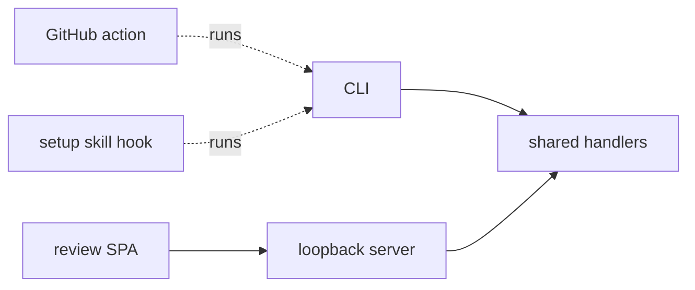

# ADR-003: Application surfaces

- Status: Accepted
- Date: 2026-08-10
- Depends on: [PDR-001](./pdr-001-product-core.md)
- Related to: [ADR-006](./adr-006-review-workflows.md), [ADR-007](./adr-007-foldkit-review-spa.md)

## Decision

**Two application surfaces, the CLI and the local review SPA, call the same handlers, which own all product behavior. No MCP server, no coding-harness adapter.**

Later adapters, the [GitHub action](./adr-008-github-action.md) and the setup skill's hook script, stay thin wrappers over the CLI.

## Context

- An earlier version had CLI commands, MCP tools, a Claude Code hook, and review routes that duplicated selection, formatting, result state, and exit behavior.
- It is unknown whether a harness integration needs product code. A documented CLI command is enough for many agents.
- The workflow must be proven before a public integration protocol is designed.

## The CLI is the whole local and CI contract

| Command                                        | Job                                                                                      |
| ---------------------------------------------- | ---------------------------------------------------------------------------------------- |
| `check`                                        | Gate selected files, changed files, or the whole repository (`--all`)                    |
| `next`                                         | One unresolved obligation with evidence, authority, and command arguments                |
| `accept`, `approve`, `propose`                 | Agent acceptance, human acceptance, agent proposal                                       |
| `explain`                                      | A rule or finding with guidance and lineage                                              |
| `rules list` / `test` / `scan` / `calibration` | List bindings, run fixtures, calibrate without enforcement, merge calibration reports    |
| `acceptances list` / `clean` / `import`        | Maintain acceptance state                                                                |
| `outcomes record` / `list`                     | Post-review observations, outside the gate                                               |
| `review`, `pr <number>`                        | Local human review, of the repository, a `--from` artifact, or a pull request's artifact |
| `init`                                         | Create `.agentlint/config.ts`, optionally `--preset package#export`                      |

Exit codes: `0` gate open, `1` unresolved findings, `2` usage, configuration, detection, or internal error. `check --format jsonl` is the machine output. The review payload and artifact are versioned.

## Handlers decide, surfaces present

- Handlers collect findings, join acceptances, validate authority, write acceptance state, produce calibration and review state, and explain findings. The CLI and server must not reimplement this.
- The SPA is optional, for complex work: calibration, human acceptance, change requests with notes, detached CI artifacts, handoff to the agent. It owns no finding, authority, or acceptance semantics. [ADR-007](./adr-007-foldkit-review-spa.md) covers it.
- The server listens on IPv4 loopback with a session token and decodes every request.
- Complete means `--all` with no file or rule selection. Only a complete check removes stale acceptances ([ADR-002](./adr-002-acceptance-model.md)).
- Local and CI share gate meaning. Only selection and presentation differ.
- Change input and base resolution: [ADR-001](./adr-001-rule-lifecycles.md). No session-start snapshots.

## CI

Normal `check` with a known base, optionally `--review-output` for a portable artifact. No hosted service. Fails on an engine error, a configuration error, or an unresolved finding.

## Package surface

| Entry point                          | Exports                                                                  |
| ------------------------------------ | ------------------------------------------------------------------------ |
| `@aurelienbbn/agentlint`             | `defineRule`, `defineConfig`, evidence and record schemas, tagged errors |
| `@aurelienbbn/agentlint/testing`     | fixture helpers, off the root so a config does not load the parser       |
| `@aurelienbbn/agentlint/contract`    | review wire contract                                                     |
| `@aurelienbbn/agentlint/calibration` | calibration report schemas                                               |

Not exported: handlers, product rules, presets.

The MCP server, Claude Code hook, harness installer, and harness event contract are removed. Any future integration is a thin adapter over the CLI or handlers, and no public protocol ships before an external consumer needs one.

## Consequences

| Gain                                                   | Cost                                                     |
| ------------------------------------------------------ | -------------------------------------------------------- |
| Unproven surfaces removed.                             | Harnesses integrate through CLI commands and exit codes. |
| One contract for local and CI.                         | Every use case lands in a shared handler first.          |
| The SPA is useful without coupling engine to an agent. | No direct continuation channel into an agent session.    |

## Rejected alternatives

| Option                         | Why not                                                                                          |
| ------------------------------ | ------------------------------------------------------------------------------------------------ |
| MCP in 0.2                     | Public surface before the CLI workflow is stable. No confirmed need.                             |
| Claude Code integration in 0.2 | One harness can bias the core. Docs and CLI give the first integration.                          |
| General harness event          | No evidence for a stable cross-harness contract.                                                 |
| UI as primary interface        | Small agent findings work better in text. The UI is for human judgment, calibration, big queues. |
| Different local and CI gates   | Local success becomes unreliable.                                                                |

## Reconsider MCP or a harness adapter when

- A supported harness cannot run the CLI at the needed checkpoint.
- A direct continuation channel materially improves the proven workflow.
- An external integration needs a stable programmatic contract.
- Documentation alone causes repeated integration failures.

Revision history

- 2026-08-10: Proposed one application path with thin adapters. Selected the CLI and the local SPA as the only 0.2 surfaces.
- 2026-08-28: Condensed and aligned with the 0.2 implementation. Recorded the `testing` and `contract` subpaths.
- 2026-09-19: Added a `setup` skill with a copyable Claude Code and Codex hook script. It is documentation over the CLI exit code. The engine gains no command, protocol, or harness-specific contract, so the decision stands.
- 2026-09-23: Reformatted for scanning. Completed the command list (`next`, `pr`, `rules calibration`, `outcomes`), added the `calibration` subpath, and linked the GitHub action as a CLI adapter. Decision unchanged.

