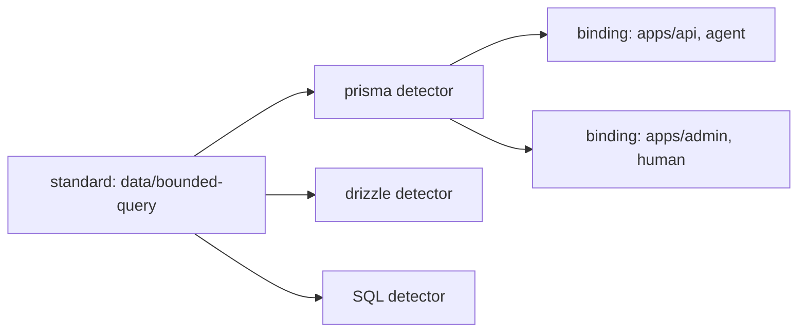

# ADR-004: Rule composition

- Status: Accepted
- Date: 2026-08-10
- Depends on: [PDR-001](./pdr-001-product-core.md)
- Related to: [ADR-001](./adr-001-rule-lifecycles.md), [ADR-005](./adr-005-fingerprints-and-lineage.md)

## Decision

**A rule = standard (the durable question) + detector (finds evidence) + repository binding (scope, options, authority), kept in separate fields of one discriminated `defineRule`.**



## Context

- Standards cross technologies. Bounded queries apply to Prisma, Drizzle, SQL, and in-house libraries, each with its own detection.
- The repository decides paths, exclusions, safe wrappers, and authority. A package author cannot.
- Reusable packages must not turn their defaults into universal policy.

## Who owns what

| Part     | Fields                                                                                         | Owner            | Bump when                                                                  |
| -------- | ---------------------------------------------------------------------------------------------- | ---------------- | -------------------------------------------------------------------------- |
| Standard | `id`, `revision`, `title`, `summary?`, `guidance`, `source?`                                   | policy author    | `revision`: decision criteria or permitted outcomes change. Not editorial. |
| Detector | `id`, `version`, `fixtures?`, then `match`/`createOnce`/`scan?` (state) or `detect` (change)   | detector package | `version`: normalized evidence semantics change                            |
| Binding  | `id`, `authority`, `include?`, `exclude?`, `options?`, `dependencies?` (state), `reviewEpoch?` | repository       | `reviewEpoch`: the repository wants a fresh review                         |

- **Standard.** No technology in the `id` unless the policy is technology-specific. `guidance` states decision checks and permitted paths, never known-bad code as an example. No authority, scope, or enabled flag.
- **Detector.** Options must not change the standard's question. If they would change evidence semantics substantially, write another detector. Detector ids are not checked for uniqueness: the package owns its namespace.
- **Binding.** Packages recommend, the repository selects. Binding ids must be unique. One detector can be bound twice with different ids and disjoint scopes. `reviewEpoch` invalidates compatible acceptances without a clock, for a policy or architecture change that source evidence does not show.

## Binding digest

```text
digest(canonical {
  reviewEpoch?   only when set, so older digests stay stable
  include        set: deduplicated, sorted
  exclude        set: deduplicated, sorted
  dependencies   set: deduplicated, sorted
  scan           "file" | "repository" | "change"
  options        keys sorted, array order kept
})
```

Reordered scope lists give the same digest. Equivalent but different globs do not. `authority` is excluded: [ADR-002](./adr-002-acceptance-model.md) checks it separately.

## Authoring

```ts
defineRule({
  lifecycle: "state",
  standard: {
    id: "data/bounded-query",
    revision: 1,
    title: "Bound database queries",
    guidance: "A production read has an explicit bound.",
  },
  detector: {
    id: "prisma/find-many-without-take",
    version: 1,
    match: { pattern: "$DB.findMany($$$ARGS)", where: { notHas: "take: $_" }, message: "$DB has no bound." },
  },
  binding: { id: "data/prisma-bounded-query", include: ["apps/api/src/**"], authority: "agent" },
});
```

- `defineRule` validates all three parts and throws `RuleDefinitionError`. No separate constructors.
- A package can export a rule factory taking repository options. It must document its detection assumptions and limits.
- Core ships no product standards, detectors, or presets.

## Identity is the full source

`FindingSource` = standard id and revision + detector id and version + binding id and digest + `reviewEpoch` when set. [ADR-005](./adr-005-fingerprints-and-lineage.md) adds the fingerprint. Acceptances key on all of it, never the standard alone.

- Findings with the same standard are not merged. Their evidence can differ in meaning or lifetime. Presentation may group them without changing the gate.
- **One standard id has one definition.** Config loading rejects rules whose standards share an id but differ in revision, title, summary, source, or guidance.
- Any source change invalidates acceptances. The prior reason can show as lineage.

## Consequences

| Gain                                                            | Cost                                                                       |
| --------------------------------------------------------------- | -------------------------------------------------------------------------- |
| Reusable detectors without universal policy.                    | Package docs must separate standards, detectors, and recommended bindings. |
| One standard, many detectors and lifecycles.                    | The engine resolves bindings before it evaluates detectors.                |
| `rules test` checks detectors. Repository checks test bindings. | Passing fixtures say nothing about a binding's scope.                      |
| Calibration gives feedback without editing binding or config.   | The repository applies calibration results by hand.                        |

## Rejected alternatives

| Option                             | Why not                                                                                                          |
| ---------------------------------- | ---------------------------------------------------------------------------------------------------------------- |
| One rule object owns all data      | Couples intent, detection, scope, and authority. Packages become rigid or over-configurable.                     |
| Package owns authority             | The author does not own the repository workflow. A recommendation helps adoption but needs repository selection. |
| Standard owns lifecycle            | A standard can need both. Lifecycle is evidence lifetime, not intent.                                            |
| Automatic detector selection       | Suggestions are fine. Auto-activation can apply wrong assumptions or scope.                                      |
| Technology-specific standards only | Duplicates guidance and policy history across stacks.                                                            |
| Match shared standards by revision | Editorial guidance edits keep the revision, so two definitions could still show reviewers different text.        |

## Reconsider when

- Detector option changes routinely need a new detector id.
- Two detectors for one standard need an explicit evidence-equivalence contract.

<details>
<summary>Revision history</summary>

- 2026-08-10: Accepted the standard, detector, and binding model. Added semantic standard revisions and material binding digests. Selected one discriminated `defineRule`.
- 2026-08-28: Condensed and aligned with the 0.2 implementation.
- 2026-09-23: Reformatted for scanning. Corrected the binding digest inputs, which also cover `dependencies`, the `scan` mode, and `reviewEpoch`. Recorded the `dependencies` and `reviewEpoch` binding fields. Decision unchanged.
- 2026-09-24: One standard id has one definition; config loading rejects rules that disagree on it.

</details>
