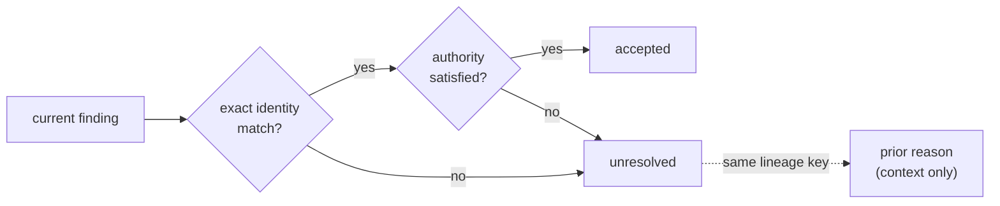

# ADR-005: Fingerprints and acceptance lineage

- Status: Accepted
- Date: 2026-08-10
- Depends on: [ADR-002](./adr-002-acceptance-model.md)
- Related to: [ADR-004](./adr-004-rule-composition.md)

## Decision

**An acceptance opens the gate for one exact finding identity. Material evidence change → new unresolved finding. A related prior acceptance is lineage context and never opens the gate. Only a complete check removes stale acceptances.**



## Context

- Formatting and line moves must keep acceptances. Evidence changes must drop them.
- Prior reasoning is useful. Its authority is not.
- No permanent lineage database.

## Identity = source + fingerprint

```text
acceptance key = canonical {
  source: {                  FindingSource (ADR-004)
    standardId, standardRevision, detectorId, detectorVersion,
    bindingId, bindingDigest,
    reviewEpoch?             only when the binding sets it
  },
  fingerprint: {
    scheme,                  evidence family: "source-structure" | "git-change"
    version,                 normalization algorithm of that scheme
    digest                   SHA-256 of canonical JSON evidence
  }
}
```

- **Canonical JSON:** sorted keys, exact Unicode strings, `-0` → `0`. Non-finite numbers, cycles, and non-plain objects fail with the exported `FingerprintError`.
- **Paths:** `\` → `/`, `.` and `..` resolved, empty segments dropped, case kept (a case rename is a move). Absolute paths and paths that escape the repository fail with `FingerprintError`.
- **Line endings:** CRLF and CR become LF when the engine reads a source file, a binding dependency, or Git change content. `core.autocrlf` and LF checkouts fingerprint equally.

## State evidence: `source-structure` v3

| In                                                                                                         | Out                                       |
| ---------------------------------------------------------------------------------------------------------- | ----------------------------------------- |
| normalized path                                                                                            | line and column positions                 |
| containing-file structure: preorder node types + child counts, leaf text, text between inner-node children | whitespace-only gaps (they enter as `""`) |
| digest of declared binding dependency contents                                                             | line-ending style                         |
| detector-reported `evidence`, if any                                                                       |                                           |
| occurrence key: structural child path (`<nodeType>:<i/j/k>`) or a unique detector key                      |                                           |

- A non-whitespace gap between children enters verbatim. Grammars leave text outside every node, such as the literal parts of a TypeScript template literal type.
- **Stable:** formatting and line movement with equal node structure.
- **Invalidates:** a file move, any structure change in the containing file, a dependency change, a reported-evidence change.
- Equal occurrences in one file get different structural paths (document order), and removing one changes the file structure. An acceptance cannot transfer to an equal sibling.

## Change evidence: `git-change` v2

| In                                             | Out                |
| ---------------------------------------------- | ------------------ |
| detector-selected `evidence`                   | commit identifiers |
| normalized before and after paths              | line positions     |
| operation: `add`, `delete`, `modify`, `rename` |                    |
| detector-owned occurrence `key`                |                    |

- An equal normalized change survives a rebase. A new base invalidates only when it changes the material comparison. A rename or move is material.
- The detector owns its evidence semantics. `key` must be non-empty, unique per file, and stable across line movement.

## Two version fields, two jobs

| Field                                | Controls                   |
| ------------------------------------ | -------------------------- |
| `AcceptanceRecord.schemaVersion`     | decoding the stored record |
| `Fingerprint.version` (per `scheme`) | comparing evidence         |

`AcceptanceRecord` = `schemaVersion`, `source`, `fingerprint`, `lineageKey?`, `reason`, `authority`, `actor?`, `acceptedAt`. Version 0.2 decodes `schemaVersion: 1` only and never infers equivalence between fingerprint versions.

## The gate opens only when all four hold

1. The engine supports the acceptance fingerprint and the finding fingerprint: only `source-structure` v3 and `git-change` v2.
2. Every `FindingSource` field is equal, `reviewEpoch` included.
3. `scheme`, `version`, and `digest` are equal.
4. Authority suffices: `human` satisfies both policies, `agent` only `agent` policy. Moving a binding to `human` makes agent acceptances insufficient.

Anything else leaves the finding unresolved. A malformed or duplicate record is a configuration error. A fingerprint error never opens a gate.

## Lineage is context, never authority

- **Key:** state = binding id + path + occurrence key. Change = the detector's key, else binding id + after path + occurrence key.
- **Match:** same lineage key, standard id, detector id, and binding id, and the record does **not** satisfy the finding. The most recent wins.
- **Shown by** `check`, `explain`, and the review SPA with reason, authority, and date, and by the GitHub action with the prior reason only. Always labelled context only.
- An agent can use it to re-judge an agent-authority finding. A human-authority finding needs a new human acceptance.

## Only a complete check removes stale records

A record is stale when a complete check (`check --all`, no file or rule filter) has no equal finding.

| Operation                             | Removes                      | Why                                           |
| ------------------------------------- | ---------------------------- | --------------------------------------------- |
| complete `check`, `acceptances clean` | stale records                | It sees every finding.                        |
| partial `check`                       | nothing                      | It cannot see unexamined findings.            |
| accept, approve, import               | only the same exact identity | Related lineage never removes another record. |

`acceptances import` checks every decision against a complete scan and the reviewed source, all-or-nothing. Git keeps old reasons; the core keeps no archive or ledger.

## Consequences

| Gain                                                          | Cost                                                                |
| ------------------------------------------------------------- | ------------------------------------------------------------------- |
| Conservative reuse: formatting and line moves keep decisions. | Any structure change in the containing file needs a new review.     |
| Prior reasoning cuts rework without keeping dead authority.   | Detector authors own evidence semantics as public contract.         |
|                                                               | Every fingerprint change is a compatibility event in release notes. |

## Rejected options

| Option                                   | Why not                                                                                                 |
| ---------------------------------------- | ------------------------------------------------------------------------------------------------------- |
| Keep acceptance after any related change | Approval survives after the evidence that justified it changes.                                         |
| Invalidate on any text change            | Safe but noisy: formatting and line moves force new judgment.                                           |
| One version number                       | Storage and fingerprint semantics change for different reasons; one field hides the migration boundary. |
| Permanent lineage records                | Recreates an event ledger. Git already keeps old records.                                               |
| Delete stale records after every check   | A partial check can delete a valid acceptance it did not examine.                                       |

## Reconsider when

- The engine can prove canonical evidence equivalence for a specific fingerprint upgrade.
- JSONL current-state storage becomes too large or too slow.
- A provider needs signed human authority.

<details>
<summary>Revision history</summary>

- 2026-08-10: Proposed, then extended with standard revisions, binding digests, and independent authority validation. Accepted after the 0.2 implementation and compatibility tests.
- 2026-08-28: Condensed and aligned with 0.2.
- 2026-09-05: `source-structure` v2 keeps Unicode distinctions and adds containing-file structure and declared dependencies, because probes showed node-only evidence kept decisions after a guard was removed. Structural occurrence identity fixes lineage collisions. Partial updates keep other exact identities even when lineage matches. v1 stays readable but needs new review.
- 2026-09-20: `source-structure` v3 adds text between child nodes and reads with LF line endings, because v2 gave template literal types with different literal text one fingerprint, and CRLF and LF checkouts different ones. v2 stays readable but needs new review.
- 2026-09-23: Reformatted. Recorded `reviewEpoch`, path rules, `FingerprintError`, the change lineage fallback, and all-or-nothing import. Decision unchanged.

</details>
