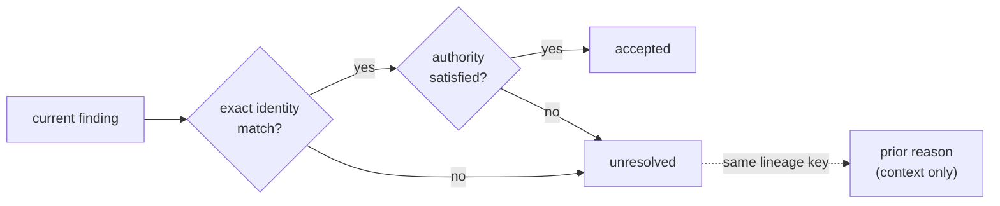
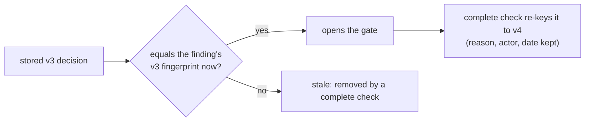

# ADR-005: Fingerprints and acceptance lineage

- Status: Accepted
- Date: 2026-08-10
- Depends on: [ADR-002](./adr-002-acceptance-model.md)
- Related to: [ADR-004](./adr-004-rule-composition.md)

## Decision

**An acceptance opens the gate for one exact finding identity. Material evidence change → new unresolved finding. A related prior acceptance is lineage context and never opens the gate. Only a complete check removes stale acceptances.**


```mermaid
flowchart LR
  F["current finding"] --> K{"exact identity<br/>match?"}
  K -- yes --> A{"authority<br/>satisfied?"}
  A -- yes --> OPEN["accepted"]
  A -- no --> U["unresolved"]
  K -- no --> U
  U -. same lineage key .-> L["prior reason<br/>(context only)"]
```

## Context

- Formatting and line moves must keep acceptances. Evidence changes must drop them.
- Prior reasoning is useful. Its authority is not.
- No permanent lineage database.

## Identity = source + fingerprint

```text
acceptance key = canonical {
  source: {                  FindingSource (ADR-004)
    standardId, standardRevision, detectorId, detectorVersion,
    bindingId, bindingDigest,
    reviewEpoch?             only when the binding sets it
  },
  fingerprint: {
    scheme,                  evidence family: "source-structure" | "git-change"
    version,                 normalization algorithm of that scheme
    digest                   SHA-256 of canonical JSON evidence
  }
}
```

- **Canonical JSON:** sorted keys, exact Unicode strings, `-0` → `0`. Non-finite numbers, cycles, and non-plain objects fail with the exported `FingerprintError`.
- **Paths:** `\` → `/`, `.` and `..` resolved, empty segments dropped, case kept (a case rename is a move). Absolute paths and paths that escape the repository fail with `FingerprintError`.
- **Line endings:** CRLF and CR become LF when the engine reads a source file, a binding dependency, or Git change content. `core.autocrlf` and LF checkouts fingerprint equally.

## State evidence: `source-structure` v4

| In                                                                                                   | Out                        |
| ---------------------------------------------------------------------------------------------------- | -------------------------- |
| normalized path                                                                                      | line and column positions  |
| containing-file structure, normalized: preorder node types + child counts, leaf text, literal values | whitespace between nodes   |
| digest of declared binding dependency contents                                                       | line-ending style          |
| detector-reported `evidence`, if any                                                                 | the formatter trivia below |
| occurrence key: path in the normalized structure (`<nodeType>:<i/j/k>`) or a unique detector key     |                            |

A formatter rewrites tokens tree-sitter keeps as nodes. v4 gives each one spelling:

| Formatter choice                                   | Normalized to                                           |
| -------------------------------------------------- | ------------------------------------------------------- |
| trailing comma before `)` `]` `}` `>`              | absent (`[a, , b]` keeps its hole)                      |
| `;`, and `,` vs `;` between interface members      | absent                                                  |
| quote style and escapes in a string                | its value; JSX attribute strings raw                    |
| `"a"` vs `a` as a property name                    | the name                                                |
| redundant parentheses around an expression or type | the tree they wrap (kept around an accessed `?.` chain) |
| `(x) =>` vs `x =>`                                 | `x` when the parameter is untyped and has no default    |
| a union's leading `\|`, nested unions              | one flat member list                                    |
| number spelling (`1.50`, `0XFF`, `1_000`, `.5`)    | its value (a legacy octal `017` stays as written)       |
| JSX line breaks and `{" "}`                        | the rendered text, per JSX whitespace rules             |
| comment layout (JSDoc `*` prefixes, re-wrapping)   | its words; `//`, `/*`, `/**` stay distinct              |
| `new Foo` vs `new Foo()`                           | no argument list                                        |

- A non-whitespace gap between children enters verbatim. Inside a template, any gap is content and enters verbatim.
- **Stable:** formatting with oxfmt or Prettier at any print width, quote, semicolon, trailing-comma, or arrow-parenthesis setting, and line movement.
- **Invalidates:** a file move, a change of an identifier, literal value, operator, or tree shape anywhere in the containing file, a dependency change, a reported-evidence change.
- Equal occurrences in one file get different structural paths (document order), and removing one changes the file structure. An acceptance cannot transfer to an equal sibling.
- A change rule's `git-change` evidence stays the detector's: a detector that reports raw lines or file digests changes with formatting. Report normalized evidence to avoid it.

### A v3 decision keeps opening the gate while its evidence is exact

v4 keeps everything v3 kept except formatter trivia, so equal v3 evidence implies equal v4 evidence. The engine computes a finding's v3 fingerprint beside its v4 one:


```mermaid
flowchart LR
  R["stored v3 decision"] --> M{"equals the finding's<br/>v3 fingerprint now?"}
  M -- yes --> A["opens the gate"] --> C["complete check re-keys it to v4<br/>(reason, actor, date kept)"]
  M -- no --> S["stale: removed by a complete check"]
```

The first complete check after upgrading moves every matching record, proposal, and imported decision to v4, whatever its merge base: every complete check sees every state finding, and only state records have a legacy version. Change records are never re-keyed; which of them a check may remove stays the merge-base rule below. A reformat before that check changes the v3 fingerprint, so those decisions need a new review: upgrade, run `check --all`, then format.

## Change evidence: `git-change` v2

| In                                             | Out                |
| ---------------------------------------------- | ------------------ |
| detector-selected `evidence`                   | commit identifiers |
| normalized before and after paths              | line positions     |
| operation: `add`, `delete`, `modify`, `rename` |                    |
| detector-owned occurrence `key`                |                    |

- An equal normalized change survives a rebase. A new base invalidates only when it changes the material comparison. A rename or move is material.
- The detector owns its evidence semantics. `key` must be non-empty, unique per file, and stable across line movement.

## Two version fields, two jobs

| Field                                | Controls                   |
| ------------------------------------ | -------------------------- |
| `AcceptanceRecord.schemaVersion`     | decoding the stored record |
| `Fingerprint.version` (per `scheme`) | comparing evidence         |

`AcceptanceRecord` = `schemaVersion`, `source`, `fingerprint`, `lineageKey?`, `reason`, `authority`, `actor?`, `acceptedAt`. Version 0.2 decodes `schemaVersion: 1` only and never infers equivalence between fingerprint versions.

## The gate opens only when all four hold

1. The engine supports the acceptance fingerprint and the finding fingerprint: only `source-structure` v4 and `git-change` v2. A `source-structure` v3 acceptance counts only while it equals the v3 fingerprint the engine computes for the finding now.
2. Every `FindingSource` field is equal, `reviewEpoch` included.
3. `scheme`, `version`, and `digest` are equal.
4. Authority suffices: `human` satisfies both policies, `agent` only `agent` policy. Moving a binding to `human` makes agent acceptances insufficient.

Anything else leaves the finding unresolved. A malformed or duplicate record is a configuration error. A fingerprint error never opens a gate.

## Lineage is context, never authority

- **Key:** state = binding id + path + occurrence key. Change = the detector's key, else binding id + after path + occurrence key.
- **Match:** same lineage key, standard id, detector id, and binding id, and the record does **not** satisfy the finding. The most recent wins.
- **Shown by** `check`, `explain`, and the review SPA with reason, authority, and date, and by the GitHub action with the prior reason only. Always labelled context only.
- An agent can use it to re-judge an agent-authority finding. A human-authority finding needs a new human acceptance.

## Only a complete check removes stale records

A record is stale when a complete check (`check --all`, no file or rule filter) that could have found it has no equal finding. A `git-change` finding exists only against a merge base, so only a check against the default branch's merge base (the one Git names, whatever ref `--base` or config `base` spells it with) can prove a change record stale.

| Operation                                                 | Removes                      | Why                                                |
| --------------------------------------------------------- | ---------------------------- | -------------------------------------------------- |
| complete `check`, `acceptances clean`, default merge base | stale records                | It sees every finding.                             |
| complete `check`, `acceptances clean`, another merge base | stale state records          | It sees change findings only relative to its base. |
| partial `check`                                           | nothing                      | It cannot see unexamined findings.                 |
| accept, approve, import                                   | only the same exact identity | Related lineage never removes another record.      |

Proposals follow the same rule.

`acceptances import` checks every decision against a complete scan and the reviewed source, all-or-nothing. Git keeps old reasons; the core keeps no archive or ledger.

## Consequences

| Gain                                                          | Cost                                                                |
| ------------------------------------------------------------- | ------------------------------------------------------------------- |
| Conservative reuse: formatting and line moves keep decisions. | Any semantic change in the containing file needs a new review.      |
| Prior reasoning cuts rework without keeping dead authority.   | Detector authors own evidence semantics as public contract.         |
|                                                               | Every fingerprint change is a compatibility event in release notes. |

## Rejected options

| Option                                   | Why not                                                                                                 |
| ---------------------------------------- | ------------------------------------------------------------------------------------------------------- |
| Keep acceptance after any related change | Approval survives after the evidence that justified it changes.                                         |
| Invalidate on any text change            | Safe but noisy: formatting and line moves force new judgment.                                           |
| One version number                       | Storage and fingerprint semantics change for different reasons; one field hides the migration boundary. |
| Permanent lineage records                | Recreates an event ledger. Git already keeps old records.                                               |
| Delete stale records after every check   | A partial check can delete a valid acceptance it did not examine.                                       |
| Store the base on each change record     | A persisted field, one record seen from several bases, and records for deleted bases that never go.     |

## Reconsider when

- The engine can prove canonical evidence equivalence for a specific fingerprint upgrade.
- JSONL current-state storage becomes too large or too slow.
- A provider needs signed human authority.

<details>
<summary>Revision history</summary>

- 2026-08-10: Proposed, then extended with standard revisions, binding digests, and independent authority validation. Accepted after the 0.2 implementation and compatibility tests.
- 2026-08-28: Condensed and aligned with 0.2.
- 2026-09-05: `source-structure` v2 keeps Unicode distinctions and adds containing-file structure and declared dependencies, because probes showed node-only evidence kept decisions after a guard was removed. Structural occurrence identity fixes lineage collisions. Partial updates keep other exact identities even when lineage matches. v1 stays readable but needs new review.
- 2026-09-20: `source-structure` v3 adds text between child nodes and reads with LF line endings, because v2 gave template literal types with different literal text one fingerprint, and CRLF and LF checkouts different ones. v2 stays readable but needs new review.
- 2026-09-23: Reformatted. Recorded `reviewEpoch`, path rules, `FingerprintError`, the change lineage fallback, and all-or-nothing import. Decision unchanged.
- 2026-10-01: A complete check against a merge base other than the default branch's keeps change records and proposals, because it cannot see their findings: a narrower base removed acceptances a later default-base check needed again.
- 2026-10-01: `source-structure` v4 normalizes formatter trivia, because reformatting 87 real files with oxfmt or Prettier at print width 80 or 120 changed 82 to 86% of v3 state fingerprints, and a quote, semicolon, or trailing-comma setting changed all of them. v4 changed none. The occurrence path follows the normalized tree, so lineage keys survive formatting too. The engine proves v3 → v4 equivalence per finding, as "Reconsider when" anticipated, so v3 decisions are re-keyed instead of reviewed again.

</details>
