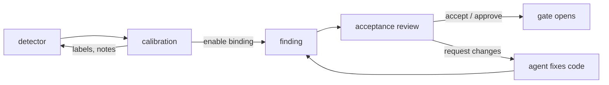

# ADR-006: Review workflows

- Status: Accepted
- Date: 2026-08-10
- Depends on: [ADR-002](./adr-002-acceptance-model.md)
- Related to: [ADR-003](./adr-003-application-and-integrations.md), [ADR-005](./adr-005-fingerprints-and-lineage.md), [ADR-007](./adr-007-foldkit-review-spa.md)

## Decision

**Calibration tests a detector before enforcement. Acceptance review resolves findings after it. Both run in the CLI or one optional local SPA, attached to the repository or detached from a CI artifact. An agent can propose; only a human opens a human-authority finding.**

Local acceptance is first-class in 0.2. Provider-verified acceptance is a later adapter.

## Context

- A small queue works in the terminal. A large one needs code context, guidance, filters, and grouping.
- CI cannot wait for a browser on another computer.
- Agents fix faster than humans read. The human needs the agent's reasoning next to the code.

## Early reporting is not a weaker gate

- Every unresolved enabled finding closes the final gate, and the final check reports all of them.
- An integration can report a finding early and let the agent continue safe work. That is deferred review, not a "non-blocking rule".
- Only `check --all` without file or rule filters is complete. A partial check never removes acceptances.

## Calibration never writes gate state

`rules scan --review` runs the fixtures, scans, and opens the SPA; `review --mode calibration` scans and opens it without running fixtures.

- Label each match `applies`, `does_not_apply` (reason required: `scope`, `detector`, `guidance`, `valid_exception`, `other`), or `unsure`, with a note.
- The server refuses accept, request changes, and withdraw in this mode.
- Labels are authoring feedback, not gate states. They live in the session: server memory when attached, the browser when detached. At finish the reviewer copies them as agent instructions or exports a versioned report.
- No candidate-rule database. The final detector, binding, fixtures, and Git history keep the result.

## Acceptance review: four outcomes

| Outcome         | How                                                     | Effect                                                                           |
| --------------- | ------------------------------------------------------- | -------------------------------------------------------------------------------- |
| Fix the code    | agent edits                                             | The finding disappears.                                                          |
| Accept          | `accept` (agent), `approve` (human), SPA accept (human) | One handler writes `.agentlint/acceptances.jsonl`. Reason required.              |
| Request changes | SPA                                                     | Sends the agent back. Text optional: message and standard carry the instruction. |
| Withdraw        | SPA **Decisions** view                                  | Revokes the decision the session showed. The finding is unresolved again.        |

- **Queue** holds what needs a decision. **Decisions** shows actor, reason, and time, so a human can audit and withdraw an agent acceptance.
- Accepting with a proposal and no typed reason records the proposal summary as the reason.
- The server refuses an action on a finding that changed or disappeared ([ADR-005](./adr-005-fingerprints-and-lineage.md)), and a withdrawal when the stored decision changed after page load.

`propose <selector> --summary "..." [--diff-file <path>]` stores agent work in `.agentlint/proposals.jsonl`, keyed like acceptances. The SPA shows it next to the code. It never opens the gate.

## Attached vs detached

|                 | Attached (`review`)                             | Detached (`review --from`, `pr <number>`)                         |
| --------------- | ----------------------------------------------- | ----------------------------------------------------------------- |
| Starts from     | the repository, loopback server + session token | `check --all --review-output <path>` in CI                        |
| Decisions go to | repository files, per action; UI refetches      | the browser, then downloaded typed JSONL with the reviewed source |
| Change requests | server memory                                   | the browser                                                       |
| Validation      | server rescans each action                      | `acceptances import` rescans, all-or-nothing                      |

- Import rejects a decision whose source or finding changed, disappeared, or needs other authority. Only then does it become an `AcceptanceRecord`.
- Detached review never claims it changed the repository. The user imports, commits, and reruns CI.
- Both end with a summary, agent instructions to copy, and acceptance output when any. The CLI prints summary and feedback when the browser finishes.

## Authority is who; verification is how

| Authority | Verification | For                                                 |
| --------- | ------------ | --------------------------------------------------- |
| Agent     | Local        | fast agent judgment with a committed reason         |
| Human     | Local        | individuals and trusted local workflows             |
| Human     | Provider     | team security via provider identity and permissions |

> [!WARNING]
> Local human acceptance is a workflow boundary. It does not prove human identity against a hostile local agent.

0.2 policy is only `agent | human`. A provider adapter may add proof metadata but must not change finding or fingerprint semantics. No required verification policy before one exists.

## Review ergonomics (2026-09-07)

| Feature                       | Does                                                                                                 | Does not                                                       |
| ----------------------------- | ---------------------------------------------------------------------------------------------------- | -------------------------------------------------------------- |
| `init --preset <pkg#export>`  | starts from explicitly chosen plugin exports                                                         | ship a preset catalog or installer; Harness owns starters      |
| `next`                        | returns one unresolved obligation; JSON has scope, authority, command argv                           | replace the complete checkpoint when a filtered queue is empty |
| Related groups                | group by detector- or binding-declared file relationships                                            | share acceptances                                              |
| Independent review            | hides prior reasons and proposals until the reviewer writes an assessment                            | act as an authorization boundary                               |
| `rules calibration <reports>` | combines reports, dedupes exact evidence, keeps policy versions apart, counts repeated invalidations | rebuild missing history, store anything, or touch the gate     |

Review artifacts are version 3; regenerate older ones. Acceptance and fingerprint formats are unchanged.

## Consequences

| Gain                                                  | Cost                                                           |
| ----------------------------------------------------- | -------------------------------------------------------------- |
| The SPA has a defined, optional role.                 | Detached review adds import, commit, and a CI rerun.           |
| Local acceptance stays fast for individuals.          | Local human authority is accountability, not identity.         |
| Proposals carry agent reasoning without a transcript. | No agent-harness resume in 0.2: the human pastes instructions. |
| Provider verification can come without a core change. |                                                                |

## Rejected options

| Option                                 | Why not                                                                                            |
| -------------------------------------- | -------------------------------------------------------------------------------------------------- |
| Provider-only human acceptance         | Stronger identity, but slows local work and excludes individuals.                                  |
| Local acceptance as identity proof     | A local agent can edit repository files. Claim nothing unenforceable.                              |
| UI-only review                         | Forces a browser for routine work. Small queues fit the terminal.                                  |
| Permanent non-blocking rules           | Findings pass without a decision. Deferred review gives speed without that.                        |
| Durable calibration database           | Adds candidate lifecycle state and cleanup. Git already keeps the result.                          |
| Auto-open the UI above a finding count | The CLI never opens a browser unasked. A person or agent opens it when the terminal is not enough. |

## Reconsider when

- A provider adapter ships.
- An agent harness can continue a session from the review server.
- Detached review needs a new artifact version.

Revision history

- 2026-08-10: Proposed calibration, checkpoint review, and local acceptance for 0.2. Accepted attached and detached review through one SPA.
- 2026-08-28: Condensed and aligned with 0.2.
- 2026-09-07: Added onboarding presets, `next`, related groups, independent review, and calibration reports, to cut review effort without changing acceptance compatibility.
- 2026-09-23: Reformatted. Corrected where calibration labels live (server memory when attached). Recorded the required `does_not_apply` reason, `review --mode calibration`, `--diff-file`, `pr`, stale-withdrawal refusal, and all-or-nothing import. Decision unchanged.

