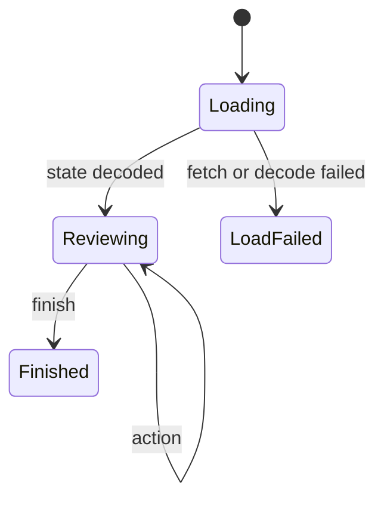

# ADR-007: FoldKit review SPA

- Status: Accepted
- Date: 2026-08-10
- Depends on: [ADR-003](./adr-003-application-and-integrations.md)
- Related to: [ADR-006](./adr-006-review-workflows.md)

## Decision

**`apps/review` is a FoldKit client-side SPA: Vite, Effect Schema, plain CSS, highlight.js, Geist fonts. React, its data and routing libraries, and the separate UI package are gone. FoldKit, `@foldkit/vite-plugin`, and Vite are pinned to exact versions.**

## Context

- The old app used React and a vendored component package.
- Review is explicit states, messages, effects, and transitions, and the backend already uses Effect.
- A full breaking rewrite was allowed before 0.2.

## One model, one update function



- One immutable Schema model: the `screen` above, `queue` / `decisions` view, facets, grouping, code view, selection, per-finding drafts, toasts, preferred editor, save state.
- Every user and server event is a discriminated message. One update function handles all transitions. Side effects are named FoldKit commands.
- Reason, calibration label, and note drafts belong to one finding. A detached decision stays a draft disposition until finish.
- `mode` and `transport` come from the payload. Calibration mode never creates acceptances. Attached review posts to `/api/action` and refetches `/api/state`. Detached review keeps decisions in the browser and builds summary, agent instructions, and acceptance JSONL at finish.

## Reviewer features

Queue and Decisions views · filter by status, authority, lifecycle, rule, text · group by file, rule, or related files · focused range or full file, highlighted · guidance, examples, references, agent proposal, prior lineage · open in a detected editor or file explorer · copy context or agent instructions · download acceptance JSONL (detached) · full keyboard control, `?` lists shortcuts.

## Drafts survive a reload

- Drafts, filters, and layout save to `localStorage` under a key derived from the payload: at once on discrete actions, after a pause while typing.
- The page warns on unload only while a detached review holds unexported decisions. Attached decisions are already on the server.
- A saved state that fails to decode (such as another schema version) moves to `<key>:bak`, so the next save cannot overwrite unexported decisions.

## One wire contract, decoded at the edge

```text
packages/agentlint/src/features/review/contract.ts    Effect Schemas, imports only `effect`
   │  published as @aurelienbbn/agentlint/contract
   ├──▶ review server HTTP payload
   ├──▶ detached artifact (same state payload, version 3)
   └──▶ apps/review (imports it, keeps no copy)
```

- All external data is decoded with Effect Schema. Invalid input shows the failure screen and never creates an acceptance.
- The loader prefers the embedded global (detached artifact), then `/api/state`.

## Testing

| Suite                                | Covers                                                                     |
| ------------------------------------ | -------------------------------------------------------------------------- |
| Vitest, SPA                          | update function, syntax highlighter, saved-state loading, browser requests |
| Vitest, server                       | payload builder, action handler, editor launchers, request authorization   |
| Playwright (`pnpm test:browser`, CI) | loading a review, keyboard help, mobile layout, in Chromium                |

## Consequences

| Gain                                                | Cost                                                   |
| --------------------------------------------------- | ------------------------------------------------------ |
| The UI uses the same Effect concepts as the engine. | Pre-1.0 dependency risk, held by exact pins and tests. |
| A large vendored component surface is gone.         | Every upgrade is an explicit change.                   |
| One focused SPA, one stylesheet, one Vite plugin.   | Not a reusable UI system.                              |

## Rejected options

| Option                       | Why not                                                                       |
| ---------------------------- | ----------------------------------------------------------------------------- |
| Keep the React app           | Smaller rewrite, but keeps several state and UI libraries through a redesign. |
| Embed FoldKit inside React   | Possible, but no incremental migration was needed.                            |
| Keep the separate UI package | One application, no external consumer.                                        |
| Tailwind or a component kit  | One stylesheet suits a small dark-only tool and keeps one build plugin.       |
| Server rendering             | A local interactive tool needs no indexing or server-rendered pages.          |

## Reconsider when

- FoldKit reaches 1.0.
- A second application needs shared components.

<details>
<summary>Revision history</summary>

- 2026-08-10: Selected FoldKit for the complete review SPA rewrite.
- 2026-08-28: Condensed and aligned with 0.2. The SPA imports the shared contract subpath.
- 2026-09-23: Reformatted. Corrected persistence (automatic saves, not a checkpoint action; unload warning only for unexported detached decisions; unreadable saves backed up) and testing (a Playwright test now runs in CI, so the "browser tests become necessary" trigger is removed). Added related-file grouping. Decision unchanged.

</details>
