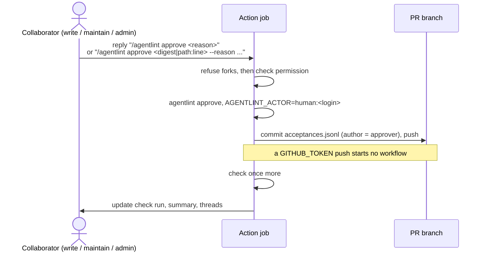

# ADR-008: GitHub action

- Status: Accepted
- Date: 2026-08-30
- Depends on: [ADR-002](./adr-002-acceptance-model.md), [ADR-003](./adr-003-application-and-integrations.md)
- Related to: [ADR-006](./adr-006-review-workflows.md)

## Decision

**One reusable action, `aurelienbobenrieth/agentlint/action@<tag>` (in `action/`), thinly wraps the CLI: it runs the same `check` as a developer, publishes the result on the pull request, and lets a collaborator with write access approve there. The `agentlint` check run is the gate; consumers make it a required status check.**

## Context

- An autonomous agent ends with a pull request. `agent` findings resolve in the agent loop. `human` findings wait for a person.
- That person had to download the artifact, open it, export, import, and push. Each step is small; together they stop the review from happening.
- A disposable review site per pull request cannot write to the repository: it removes one download and adds a deployment.

## One run, three surfaces

| Surface                                      | Content                                                                                                                      |
| -------------------------------------------- | ---------------------------------------------------------------------------------------------------------------------------- |
| `agentlint` check run on the head commit     | `success` = open gate, `failure` = unresolved findings, `action_required` = configuration error. One annotation per finding. |
| One sticky summary comment                   | Edited in place. Every finding with a file:line link, authority, and the exact command that resolves it.                     |
| One inline thread per finding on a diff line | Standard, agent proposal if any, prior reason (context only) after an invalidation.                                          |

- GitHub allows inline comments only on diff lines, so other findings appear only in the summary.
- Threads reconcile by finding digest: still present → kept; accepted or gone → one reply, then resolved.

## Approving from the pull request

- The gate opens when the last acceptance lands. No workflow rerun per approval.
- `/agentlint check` rescans and republishes.
- If the branch moves during the push, the approval is reapplied on the new head, where the CLI rechecks the evidence, up to 3 attempts. Correctness does not depend on serialized runs.
- Authority is accountability, not identity: the record names the GitHub login and the push is in branch history, the same boundary as a local acceptance.

## Forks get no gate

With a read-only token, the action prints workflow annotations, uploads the artifact, exits with the gate code, writes no comment or check run, and refuses approval commands.

> [!WARNING]
> A fork's job status comes from the fork's own configuration and acceptances, so it is not a trustworthy gate. A maintainer pushes the commits to a branch here to run the real gate. `pull_request_target` is refused because repository configuration executes code.

## Local side: `agentlint pr <number>`

Downloads the pull request's review artifact with `gh` and opens it in the review SPA. A client convenience over the artifact contract, not a bot, so the core holds no GitHub credentials.

## Testing

- Plain Node modules in `action/src`, tested with recorded event payloads and a mocked `fetch`.
- `dry-run: true` prints every write instead of sending it. The `Action smoke` workflow runs it on `examples/demo` for every pull request.
- The throwaway `agentlint-playground` repository uses the action from a branch for real threads, approvals, and pushes.

## Consequences

| Gain                                                       | Cost                                                                                                                            |
| ---------------------------------------------------------- | ------------------------------------------------------------------------------------------------------------------------------- |
| Human review happens on the pull request.                  | GitHub-specific code in `action/` and the `pr` command.                                                                         |
| Engine, acceptance model, and artifact contract unchanged. | The action's default `version` is pinned to the package; both move at release (`packages/agentlint/scripts/sync-versions.mjs`). |
| The default `GITHUB_TOKEN` is enough.                      | Fork pull requests cannot be gated or approved from GitHub.                                                                     |

## Rejected options

| Option                            | Why not                                                                                                                                                    |
| --------------------------------- | ---------------------------------------------------------------------------------------------------------------------------------------------------------- |
| Disposable review site per PR     | Cannot write acceptances, publishes review data, costs a deployment each time.                                                                             |
| Approve by GitHub review          | One "Approve" would accept every human finding at once, with no reason per finding.                                                                        |
| Workflow rerun per approval       | Repeats the pipeline. The check run holds gate state, so one scan in the approval job suffices.                                                            |
| Bot review with "request changes" | Some teams forbid bots from blocking merges, and a bot approval misleads. The action never submits an approving or blocking review; the check run decides. |
| Mandatory personal access token   | Nothing needs retriggering, so `GITHUB_TOKEN` is enough.                                                                                                   |

## Reconsider when

- A consumer needs a signed, non-repudiable acceptance, not an accountable login → add a GitHub App identity.
- A consumer on another provider needs it → add that adapter. The artifact contract and CLI stay the shared surface.

Revision history

- 2026-08-30: Accepted.
- 2026-09-23: Reformatted. Recorded the version sync script, the `path:line` selector, `/agentlint check`, the push retry, the untrusted fork status, and the `pull_request_target` refusal. Decision unchanged.

