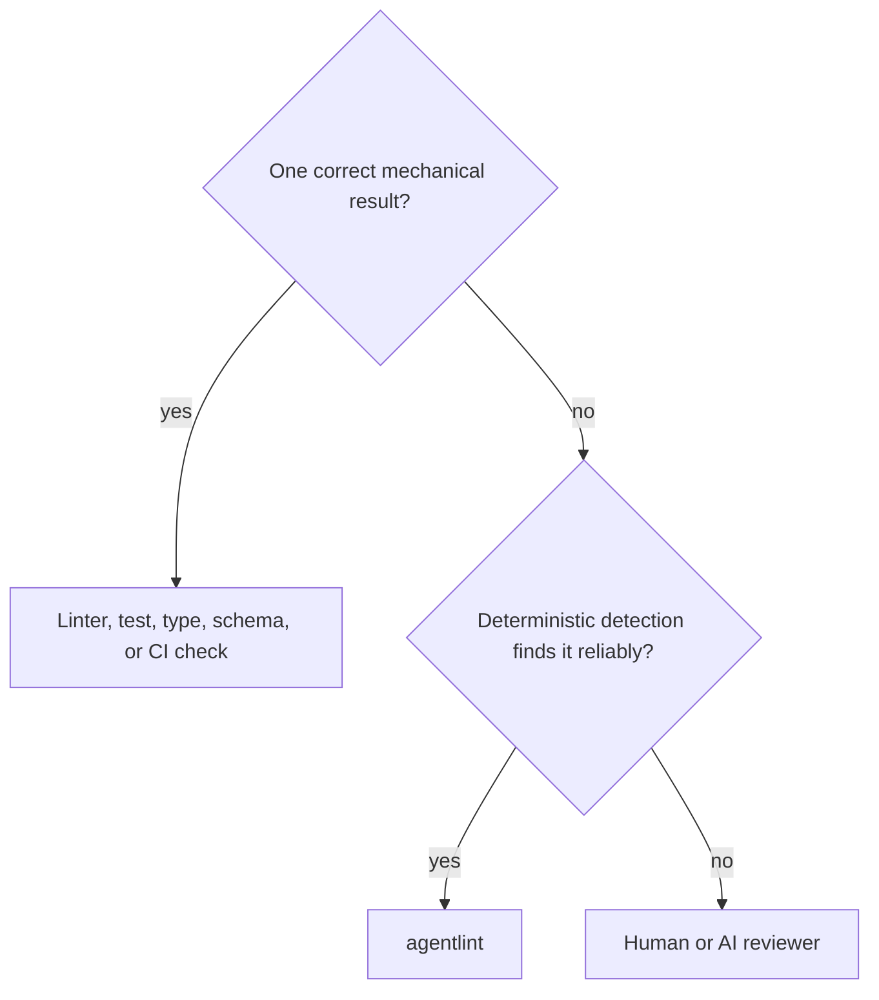

# PDR-001: Product core

- Status: Accepted
- Date: 2026-08-10
- Owners: agentlint maintainers
- Related to: [ADR-001](./adr-001-rule-lifecycles.md), [ADR-002](./adr-002-acceptance-model.md), [ADR-004](./adr-004-rule-composition.md)

## Decision

**agentlint turns recurring human review judgment into deterministic, repository-owned gates for coding agents.**

It detects a judgment point, shows the repository's standard, and keeps the gate closed until the evidence changes or an acceptance with sufficient authority matches the exact finding. Agents may help write rules; the engine never calls an AI model.

## Context

- Agents miss repository instructions when they apply; reviewers repeat the same feedback.
- Prompts and skills guide, but cannot guarantee the guidance fires for each applicable condition.
- Linters and tests cover one-right-answer checks. Judgment calls (context, risk, exceptions) had no deterministic gate.

agentlint never replaces a better mechanical check or a necessary semantic review.

## Priorities

1. Make configured review obligations explicit and their decisions attributable.
2. Prevent repeated review feedback and missed repository instructions.
3. Add human gates for sensitive changes.
4. Keep a reviewable record of accepted findings.

Primary users, equal priority: an individual developer with a coding agent, and an engineer who defines team standards. Lower: platform teams and rule package authors. The core serves one repository with no central service.

## Product promise

1. A repository owns its rules and acceptance records.
2. The engine detects each configured condition deterministically.
3. A finding gives short guidance for the judgment.
4. The gate stays closed until the code changes or an authorized actor accepts.
5. A material code change invalidates an acceptance.
6. Local checks and CI share gate semantics.
7. An agent cannot accept a human-authority finding through the agent command.

An acceptance is a recorded decision: not proof it is correct, nor of the local actor's identity.

## A rule is standard + detector + binding

| Part     | Holds                                                                                                  | Constraint                                                                                                                         |
| -------- | ------------------------------------------------------------------------------------------------------ | ---------------------------------------------------------------------------------------------------------------------------------- |
| Standard | One durable review question, revision, guidance, optional source reference                             | ID stays stable when title or guidance changes                                                                                     |
| Detector | Evidence for the question; one `state` or `change` lifecycle ([ADR-001](./adr-001-rule-lifecycles.md)) | Optional `mustReport` / `mustStaySilent` fixtures are regression evidence, not exhaustive, and never sent to the agent as guidance |
| Binding  | Scope, options, `agent` or `human` authority                                                           | Repository-owned; a package cannot impose authority or scope                                                                       |

[ADR-004](./adr-004-rule-composition.md) defines composition. The package ships the engine and authoring API, never product rules or presets.

## A merged, enabled rule enforces immediately

A proposed rule is a normal code change, authored with agent help. No candidate state, observation database, backlog, or warning-only mode.

| Engine owns                                                                                                     | Coding agent owns                                                                                     |
| --------------------------------------------------------------------------------------------------------------- | ----------------------------------------------------------------------------------------------------- |
| Rule loading, detection, finding identity, acceptance validation, file and change selection, output, exit codes | Semantic interpretation, repository research, clarifying questions, writing rules, fixtures, guidance |

`agentlint rules test` runs fixtures. `agentlint rules scan --review` calibrates a detector on the repository without creating acceptance state.

## Humans hold authority; agents propose

| Binding | Agent acceptance opens gate | Human acceptance opens gate | Proposal opens gate |
| ------- | --------------------------- | --------------------------- | ------------------- |
| `agent` | Yes                         | Yes                         | No                  |
| `human` | No                          | Yes                         | No                  |

On a human finding the agent fixes the evidence, asks a human, or runs `agentlint propose`; `agentlint review` shows the proposal's summary and diff beside the finding.

> [!NOTE]
> The local human gate is a workflow boundary, not a security boundary. Any process with write access, the agent included, can edit the config and acceptance file; Git review makes it visible. Protected branches and provider reviews are stronger. Actor text is audit information, not identity proof.

## The CLI is the interface

No MCP server, harness hook, or provider SDK in core. Integrations call the CLI and read the exit code: `0` gate open, `1` unresolved findings, `2` usage, configuration, or evidence error.

- `agentlint review` serves a local SPA for human decisions; agents don't need it.
- CI writes a detached artifact with `check --review-output`; `acceptances import` validates its decisions against a fresh detector run.
- `.agentlint/acceptances.jsonl` holds only current acceptances; Git keeps history ([ADR-002](./adr-002-acceptance-model.md)).

## Consequences

| Gain                                                 | Cost                                                 |
| ---------------------------------------------------- | ---------------------------------------------------- |
| Code that doesn't serve the core workflow is removed | Adjacent features (notes, presets, ledgers) stay out |
| Rule creation is optimized first                     | Audit functions wait                                 |
| Small acceptance model                               | A new state must bring different gate behavior       |
| Positioned as a judgment gate, not only a linter     | —                                                    |

## Rejected options

| Option                   | Why not                                                                                                                                                                                       |
| ------------------------ | --------------------------------------------------------------------------------------------------------------------------------------------------------------------------------------------- |
| AST linter only          | Some concerns exist only in a change. AST detection stays one capability.                                                                                                                     |
| Candidate rule lifecycle | Product state before a rule exists. A rule becomes state only when the repository accepts the code change.                                                                                    |
| Warning-only rules       | Agents ignore guidance with no result. A future distribution layer may add a time-limited observation period with an owner, expiry, and promotion criteria.                                   |
| Append-only ledger       | The file grows with all history; Git already keeps it.                                                                                                                                        |
| Built-in presets         | Splits work between engine and a small catalog. Repository-specific judgment is the value.                                                                                                    |
| Learned notes            | 0.2 added non-blocking Markdown notes with file and text triggers: a second product model that dilutes output meaning. Agents can search `AGENTS.md` and decision records. Removed from core. |

## Reconsider when

| Capability                  | Trigger                                                                                                                                    |
| --------------------------- | ------------------------------------------------------------------------------------------------------------------------------------------ |
| Observation periods         | One rule package spans many repositories, a new rule finds a large backlog, or a central team owns rules for teams that didn't author them |
| Learned notes               | Users repeatedly ask for deterministic non-blocking context that can stay separate from enforced output                                    |
| Provider-verified authority | A team needs identity proof local review cannot give                                                                                       |

Revision history

- 2026-08-10: Accepted after the 0.2 self-review. Same day: split fixtures from agent guidance; added enforcement classes, durable standards, rollout conditions; made standards, detectors, and bindings separate objects; required `state` and `change` workflows in the 0.2 baseline.
- 2026-08-28: Condensed and aligned with the 0.2 implementation.
- 2026-09-05: Primary value clarified as explicit review obligations and traceable decisions for individual developers and small teams; an acceptance is a recorded decision, not proof of correctness or authenticated local identity.
- 2026-09-23: Reformatted for scanning. Decision unchanged.

