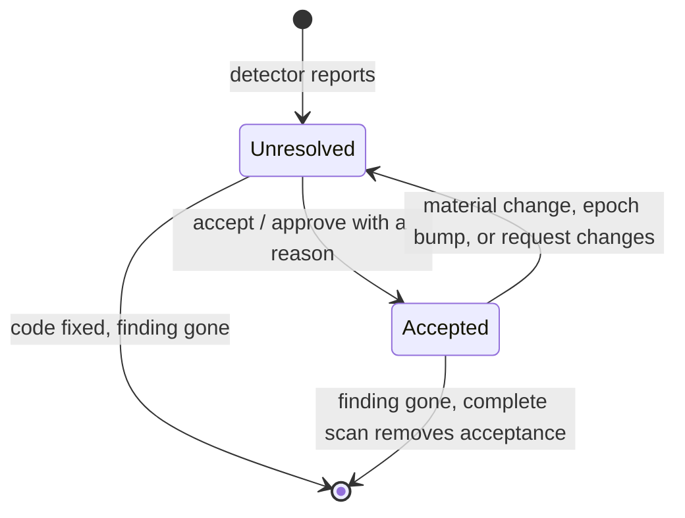

# Acceptance: who closes a finding, and what reopens it

**Every current finding is accepted or unresolved. An acceptance opens the gate only when every part of its identity matches the current finding exactly, and the binding's authority allows it.**



## The binding's authority decides who may close a finding

| Binding authority | Closed by                 | Command                    |
| ----------------- | ------------------------- | -------------------------- |
| `agent`           | agent or human acceptance | `accept`                   |
| `human`           | human acceptance only     | `review` (UI) or `approve` |

An agent acceptance can't satisfy a human binding; a human acceptance satisfies either.

```bash
pnpm agentlint explain 1
pnpm agentlint accept 1 --reason "The containing function restricts this read to the verified finite lookup dataset."
pnpm agentlint review
pnpm agentlint approve 1 --reason "Backfill and restore drill linked in the migration."
```

Every acceptance needs a concrete reason. Architectural, privacy, destructive-operation, and public-contract rules normally use human authority: an agent can't ratify its own contextual conclusion.

## An agent proposes; a human ratifies

When an agent has done the work but can't decide, it attaches a proposal so the reviewer sees the change next to the evidence:

```bash
git diff src/migrations/2026-06-drop-legacy-flag.ts > /tmp/backfill.diff
pnpm agentlint propose 6 --summary "Added an idempotent backfill before the drop." --diff-file /tmp/backfill.diff
```

`.agentlint/proposals.jsonl` holds one proposal per exact finding identity. A proposal is context for a human; it never opens a gate. In the [review UI](review.md), an existing proposal can become the acceptance reason.

## `next` hands the agent one finding at a time

`agentlint next --format json` returns a version 1 handoff. Decode it with `NextResult` from `@aurelienbbn/agentlint/contract`.

| It contains            |                                                                                                    |
| ---------------------- | -------------------------------------------------------------------------------------------------- |
| One unresolved finding | Full available source, detector excerpt, guidance, explicit related file paths, required authority |
| Queue context          | Remaining count and scan scope                                                                     |
| Suggested commands     | Argument arrays: acceptance for agent authority; proposal and human review for human authority     |

The caller supplies required reasons and summaries separately.

| Behavior  |                                                                                                           |
| --------- | --------------------------------------------------------------------------------------------------------- |
| Order     | Stable by file, line, exact identity                                                                      |
| Scan      | Complete by default, rescanned every call, with `check --all`'s compatibility and stale cleanup           |
| `--rule`  | Narrows the scan and reports partial coverage; a cleared filtered queue isn't a complete checkpoint       |
| Selectors | Actions and JSON `selector` use the **full finding key**, independent of the last `check`'s ordinal cache |
| Exit      | `0` scope clear, `1` unresolved work, `2` invalid configuration or evidence (or internal error)           |

## Every part of the identity must match

`.agentlint/acceptances.jsonl` is current state, not an event log. It shows in the pull request diff.

| Part         | Must match                             |
| ------------ | -------------------------------------- |
| Standard     | id + revision                          |
| Detector     | id + version                           |
| Binding      | id + material binding digest           |
| Review epoch | `binding.reviewEpoch`, when configured |
| Fingerprint  | scheme + version + evidence digest     |
| Authority    | sufficient for the binding             |

State fingerprints (version 3) cover the containing file's syntax, the structural occurrence, optional reported evidence, and the contents of explicit [`binding.dependencies`](writing-rules.md#dependencies-make-another-file-part-of-the-justification):

| Edit                                          | Acceptance       |
| --------------------------------------------- | ---------------- |
| Whitespace between syntax nodes               | kept             |
| Literal or comment contents                   | invalidated      |
| File structure, even outside the matched call | invalidated      |
| A declared dependency's contents              | invalidated      |
| A change rule's reported `evidence`           | invalidated      |
| Unicode source values                         | compared exactly |

This is deliberately conservative: edits elsewhere in a busy file may need another review. Unsupported evidence never satisfies a finding.

## A review epoch forces fresh review without a clock

`binding.reviewEpoch` is an optional positive integer the repository controls. Bump it when otherwise unchanged decisions need fresh review because an assumption, policy period, or ownership changed.

The epoch participates in finding identity, so bumping it invalidates compatible acceptances without consulting wall-clock time. agentlint never expires a decision because a date passed.

## Complete scans remove dead acceptances

| Scan                                                        | Unexamined acceptances |
| ----------------------------------------------------------- | ---------------------- |
| Complete (`check --all`, `next`, `acceptances clean`)       | Dead ones removed      |
| Partial (`check` without `--all`, explicit files, `--rule`) | Kept                   |

```bash
pnpm agentlint acceptances list
pnpm agentlint acceptances clean
```

Lineage can show a prior reason after invalidation, as context. It never opens the new gate. Git keeps the history; see [guarantees](guarantees.md#storage-writes-are-locked-and-atomic).

## Pre-v1: current format only

There is no migration or backward-compatibility layer. After a breaking change, regenerate artifacts and review findings again. Version fields stay part of the gate contract.
