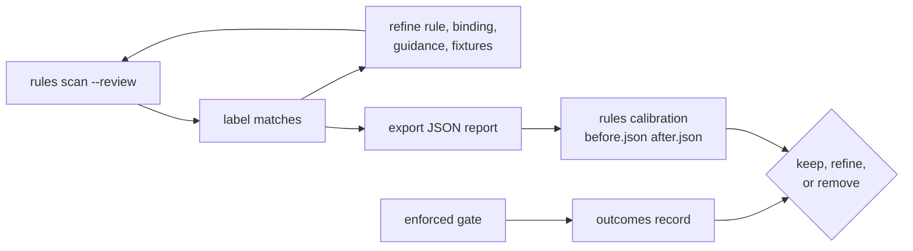

# Calibration and outcomes: keep a rule only while it earns its place

**Calibrate a rule on real code before it gates anything, then record what happened later. Neither calibration reports nor outcomes ever open or close a gate.**



## Calibrate before enforcing

```bash
pnpm agentlint rules scan --rule data/bounded-reads --review
pnpm agentlint rules calibration before.json after.json --format json
```

`rules scan` runs the rules without the gate; `--review` opens the review UI in calibration mode on the results. It creates no acceptance state and blocks nothing.

| Label              | Needs                                                         |
| ------------------ | ------------------------------------------------------------- |
| **applies**        | nothing                                                       |
| **does not apply** | a category: scope, detector, guidance, valid exception, other |
| **unsure**         | nothing                                                       |

Notes add context. Refine the rule, binding, guidance, and fixtures from the feedback. The view shows saved labels and the applicability rate over decided labels; unsubmitted edits don't count.

## Reports combine across sessions

Download a version 1 JSON report during the session or on completion. Save successive exports under distinct names and combine reports from the same repository with `rules calibration`:

- each exact finding counts once; later files replace labels for duplicate evidence;
- standards, detector versions, and material bindings stay separate;
- the summary adds non-applicability categories and lineages with at least two distinct observed invalidated identities;
- no decided labels means a null rate ("not measured"), not a perfect score.

Reports are observational, never acceptance inputs. They can't reconstruct unobserved history or prove detector recall. Schemas and pure helpers: `@aurelienbbn/agentlint/calibration`.

## Record what happened later

A green gate isn't proof of long-term maintainability. When later work supplies evidence, attach it to the current finding:

```bash
pnpm agentlint outcomes record 4 --kind corrective_change --reference commit:abc123 \
  --note "A second owner drifted from the policy."
pnpm agentlint outcomes list
pnpm agentlint outcomes list --format json
```

Kinds: `useful_interception`, `unnecessary_review`, `escaped_concern`, `corrective_change`, `rollback`, `incident`.

- `.agentlint/outcomes.jsonl` is a committed observational record. It never opens or closes a gate.
- The same finding + kind + reference updates the note; distinct outcomes accumulate.
- `list` groups by rule and kind, so you can keep, refine, or remove rules on delayed evidence.

For a structured small-team evaluation without telemetry or a central service, use [the pilot worksheet](../review-pilot.md).

Calibration and outcomes are conceptually inspired by desloppify by Peter O'Malley; implementation and contracts are original to agentlint, and no code or instructions were copied.
