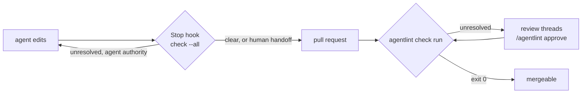

# CI and agent hooks: the required check is the gate

**Make the `agentlint` CI check required: that is the gate. Local hooks stop the agent early, but they are feedback.**



## The GitHub action runs the gate on every pull request

The [GitHub action](../../action/README.md) creates:

- an `agentlint` check run with one annotation per finding;
- a live summary comment;
- one review thread per finding on the diff.

A collaborator with write access replies `/agentlint approve <reason>` in a thread to record human authority. The action commits the acceptance on the branch as that person and updates the check without re-running the workflow.

```yaml
name: agentlint
on:
  pull_request: { types: [opened, synchronize, reopened, ready_for_review] }
  issue_comment: { types: [created] }
  pull_request_review_comment: { types: [created] }
permissions: {}
jobs:
  gate:
    if: github.event_name == 'pull_request'
    runs-on: ubuntu-latest
    permissions: { contents: read, pull-requests: write, checks: write }
    steps:
      - uses: actions/checkout@v5
        with: { fetch-depth: 0, persist-credentials: false } # required: change rules use the merge base
      - uses: actions/setup-node@v5
        with: { node-version: 22 }
      - uses: aurelienbobenrieth/agentlint/action@v0.2.2
  command:
    if: >-
      (github.event_name == 'issue_comment' && github.event.issue.pull_request && startsWith(github.event.comment.body, '/agentlint'))
      || (github.event_name == 'pull_request_review_comment' && startsWith(github.event.comment.body, '/agentlint'))
    concurrency:
      group: agentlint-command-${{ github.event.issue.number || github.event.pull_request.number }}
      cancel-in-progress: false
    runs-on: ubuntu-latest
    permissions: { contents: write, pull-requests: write, checks: write }
    steps:
      - uses: actions/checkout@v5
        with: { fetch-depth: 0, persist-credentials: false }
      - uses: actions/setup-node@v5
        with: { node-version: 22 }
      - uses: aurelienbobenrieth/agentlint/action@v0.2.2
```

- `fetch-depth: 0` is required: change rules use the merge base.
- `persist-credentials: false` keeps the token out of `.git/config`, where the install and `.agentlint/config.ts` could read it. The action passes it to `git fetch` and the approval push itself.
- The action runs `npx @aurelienbbn/agentlint@<version>` and resolves the package for `.agentlint/config.ts` itself. Set `install: true` only if the config imports third-party rule packages.
- Fork pull requests get a read-only token: annotations and the review artifact, no comments or approvals.
- Every input and output, and `dry-run` for testing: [action README](../../action/README.md).

## Any other CI runs the same two commands

```yaml
- run: npx @aurelienbbn/agentlint rules test
- run: npx @aurelienbbn/agentlint check --all --base "origin/${{ github.base_ref }}" --review-output artifacts/agentlint-review.json
- uses: actions/upload-artifact@v4
  if: failure()
  with: { name: agentlint-review, path: artifacts/agentlint-review.json }
```

Open an uploaded artifact locally with `agentlint pr <number>` or `agentlint review --from <path>`; see [detached review](review.md#detached-ci-review-keeps-the-gate-closed-until-you-import).

## A hook makes the agent stop at the gate

An instruction is a request; a hook is a checkpoint. Copy the adapter that ships with the `setup` skill and commit it:

```bash
mkdir -p .agentlint/hooks
cp node_modules/@aurelienbbn/agentlint/skills/agentlint/setup/agentlint-gate.mjs .agentlint/hooks/
```

Register it in Claude Code (`.claude/settings.json`) or Codex (`.codex/hooks.json`, in a trusted project). Both use the same shape:

```json
{
  "hooks": {
    "Stop": [{ "hooks": [{ "type": "command", "command": "node .agentlint/hooks/agentlint-gate.mjs stop" }] }]
  }
}
```

| `check --all` reports an unresolved finding needing | At `Stop`                                                                                                       |
| --------------------------------------------------- | --------------------------------------------------------------------------------------------------------------- |
| agent authority                                     | The turn can't end; findings and the next action come back as feedback                                          |
| human authority                                     | Interrupts once, then ends: the agent proposes its work and hands over to `agentlint review` instead of looping |

- The adapter is one short script over the CLI exit code and owns no gate semantics.
- The `setup` skill also documents an optional per-edit `PostToolUse` hook.
- Other agents: put one line in `AGENTS.md` telling them to run `agentlint check --all` before finishing.

## Integrations call the CLI; the engine stays small

The engine contains no MCP server, harness protocol, GitHub bot, or provider SDK. Integrations, including the `setup` hook adapter, call the CLI and read its [exit code](cli.md#exit-codes).

- A harness may continue past a non-blocking `check` mid-loop but must report unresolved findings before finishing. Use `check --all` as the hard gate at checkpoints and in CI.
- Provider adapters (pull request comments, ownership routing, signed human authority) live outside the engine and keep the same current-finding and acceptance semantics. They are added only when the CLI and artifact contract can't deliver the required experience.
