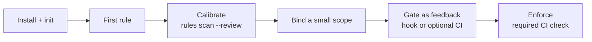

# Get started: install, write one rule, then enforce

**Install agentlint, turn one repeated review correction into a rule, calibrate it on your code, and make the CI check required last. There is no warning level.**



## Let your agent install it

Agent skills ship in `node_modules/@aurelienbbn/agentlint/skills`. [TanStack Intent](https://tanstack.com/intent) discovers them; any agent can read them.

```text
Install @aurelienbbn/agentlint and follow its setup skill
(node_modules/@aurelienbbn/agentlint/skills/agentlint/setup/SKILL.md).
```

The `setup` skill initializes the config, helps you express standards you already enforce, calibrates before enforcing, and installs the Claude Code or Codex [hook](ci.md#a-hook-makes-the-agent-stop-at-the-gate).

## Or install by hand

```bash
pnpm add -D @aurelienbbn/agentlint
pnpm agentlint init   # creates .agentlint/config.ts, gitignores ephemeral selector and transaction files
```

| Path                                               | Commit it?                           |
| -------------------------------------------------- | ------------------------------------ |
| `.agentlint/config.ts`                             | Yes                                  |
| `.agentlint/acceptances.jsonl`                     | Yes, once it exists                  |
| `.agentlint/outcomes.jsonl`                        | Yes ([outcomes](calibration.md))     |
| `.agentlint/.cache/`, `*.lock`, `*.tmp` transients | No. `init` adds them to `.gitignore` |

Every command accepts `--help`. The full command list is in the [CLI reference](cli.md).

## Your best first rule is a correction you've made twice

```text
Use the agentlint rule-advisor skill. I keep correcting this in review: <the correction>.
```

`rule-advisor` first checks whether a linter, type, or test fits better. If judgment is needed, it writes the standard, a pattern detector, and activation and silence fixtures, then calibrates against your real code with `rules scan --review` before anything is enforced. A pattern rule is about twenty lines; review it like any code. [Writing rules](writing-rules.md) covers the format.

Keep a rule only while the review work it saves exceeds its interruptions and upkeep. [The pilot worksheet](../review-pilot.md) measures that for a small team, without telemetry or a central service.

## Or start from a plugin

Rule packages are ordinary npm packages exporting `defineRule` values and presets:

```bash
pnpm agentlint init --preset "<rule-package>#<preset-export>"   # repeat --preset to compose
pnpm agentlint rules test
pnpm agentlint rules scan --review
pnpm agentlint next --format json
```

- Each `--preset` value is a package name, `#`, and an exported configuration.
- `init` prints a `pnpm add` command to adapt to your package manager. It never installs or executes plugins, and it preserves an existing config. Install compatible plugin packages before running their rules.
- You own the resulting imports and can narrow scopes or pick individual rules.
- The engine has no catalog, default rules, or plugin dependency. Use packages available from your own registry or workspace.
- Plugin authors: declare the compatible agentlint range as a peer dependency and document the judgment your preset introduces.

## Adopt gradually: there is no warning level

Agents learn to ignore warnings, and a finding nobody must answer leaves no record. Control adoption with what you bind and where you enforce:

| Step                | Do                                                                                                                                                                                                          | Required in CI?                     |
| ------------------- | ----------------------------------------------------------------------------------------------------------------------------------------------------------------------------------------------------------- | ----------------------------------- |
| 1. Calibrate        | `rules scan --review` lists matches and creates no acceptances. Label them, then fix detector, scope, and guidance.                                                                                         | No                                  |
| 2. Bind small       | Start `binding.include` at directories under active work and widen later. For new-work-only concerns, use a `change` rule: it judges the diff from the merge base, so existing code creates no obligations. | No                                  |
| 3. Gate as feedback | Run `check` in a hook or a non-required CI job. Nothing depends on its exit code yet.                                                                                                                       | No (a hook can stop the agent turn) |
| 4. Enforce last     | Once `check --all` exits `0`, make the [CI check](ci.md) required.                                                                                                                                          | Yes                                 |

Don't open a gate by bulk-accepting findings with a generic reason. Work the queue with [`agentlint next`](acceptance.md#next-hands-the-agent-one-finding-at-a-time), or narrow the binding until the queue is one you intend to answer.
