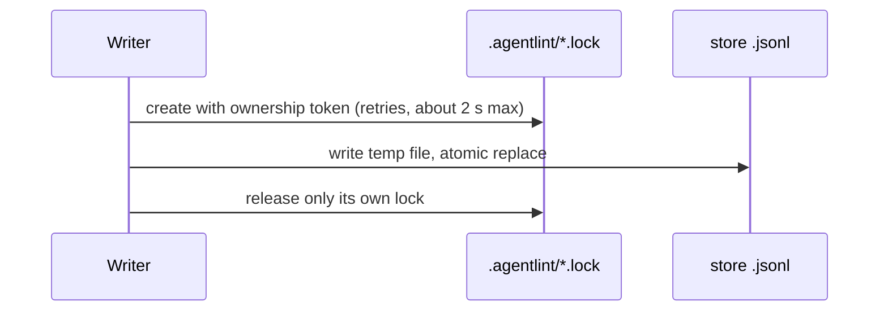

# Guarantees and limits

**The same repository state produces the same findings: no model, network, or clock. An open gate proves every current finding in the reported scan scope has a compatible recorded decision, and nothing more.**

> [!NOTE]
> An open gate does not prove the judgment was correct, or that unconfigured concerns were reviewed.

## What a scan reads, and when it fails

| Scan               | Behavior                                                                                                     |
| ------------------ | ------------------------------------------------------------------------------------------------------------ |
| State parsing      | JavaScript, TypeScript, TSX, JSON. Change detectors also consume Git evidence for other file types.          |
| Full enumeration   | Git listing (tracked + unignored untracked): `.gitignore` decides, and a tracked `dist/` file is scanned     |
| Outside Git        | Directory walk skipping only `node_modules` and `.git`                                                       |
| Always excluded    | `.agentlint/.cache/` and config `ignores`, in both modes                                                     |
| Explicit directory | Expands recursively                                                                                          |
| Scan fails on      | Missing explicit path, failed read, incomplete or unsupported syntax, path outside the repo, invalid binding |
| Partial scan       | Never qualifies for complete stale cleanup                                                                   |

## Storage writes are locked and atomic

Acceptance, proposal, and outcome writes take an exclusive cross-process lock and replace the file atomically.

- A failure before replacement keeps the previous file; afterwards readers see the complete new file.
- Power-loss durability and network filesystems are not certified.
- A transaction holds its `.agentlint/*.lock` for milliseconds. Locks carry an ownership token, and a writer releases only its own.
- **A lock is never stolen based on age**: a paused process may resume and write. After an abrupt process death, delete the orphaned lock by hand. The CLI fails clearly after a bounded wait (about 2 seconds).
- Git keeps historical decisions and outcomes. Lineage explains invalidation from the pre-cleanup snapshot; it is not a history service.

## Local human authority is accountability, not identity

Local human authority is not cryptographic identity. Anyone with repository write access can edit configuration and acceptance files; Git review makes that visible. Provider-backed proof can be added later without changing gate semantics. The full threat model is in [the security model](../security-model.md).

| Boundary                                 | What it guarantees                                         |
| ---------------------------------------- | ---------------------------------------------------------- |
| Repository-authored imperative detectors | Trusted code; `rules test` replays fixtures to catch drift |
| Independent review hides prior reasons   | Presentation only; data stays in the browser payload       |
| Review server                            | Loopback with a session token                              |
| "Open in…"                               | Browser sends only a finding id and an allowlisted app     |

## Failures are typed

| Error                   | Raised when                                                                                        |
| ----------------------- | -------------------------------------------------------------------------------------------------- |
| `RuleDefinitionError`   | `defineRule` receives an invalid rule (its only thrown error)                                      |
| `ConfigError`           | `defineConfig` receives an invalid config (its only thrown error)                                  |
| `DetectorContractError` | A detector breaks the reporting contract or returns a promise; the rule fails with it as the cause |
| `FingerprintError`      | A fingerprint input has an invalid value or path                                                   |
| `PatternError`          | A pattern doesn't parse, a query is invalid, or a frontend or fixture grammar is unsupported       |
| `ParserError`           | A grammar is missing or unknown, or the parser fails to initialize, load, or parse                 |

Configuration, evidence, and internal failures exit `2`, never `1`: a failure never passes for unresolved findings or an open gate.
