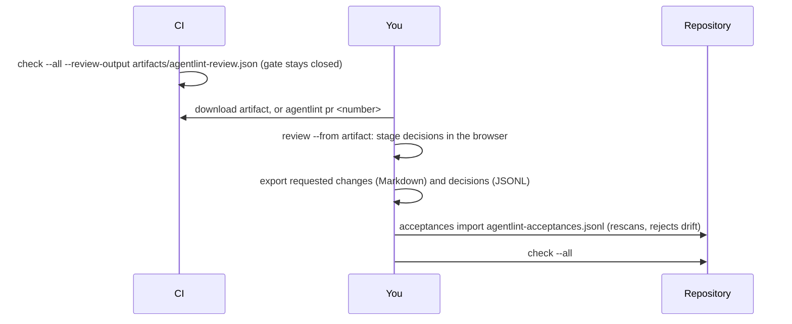

# Review: humans decide with code, standard, and proposal side by side

**`agentlint review` opens a keyboard-first local UI. CI can't wait for a browser, so it emits the same review as a portable artifact and keeps the gate closed.**

| Where the human works | Start with                                                      |
| --------------------- | --------------------------------------------------------------- |
| Locally               | `agentlint review`                                              |
| On a CI artifact      | `agentlint review --from <artifact>` or `agentlint pr <number>` |
| In the pull request   | `/agentlint approve <reason>` ([GitHub action](ci.md))          |

## The local UI has two views and one decision per finding

`agentlint review` serves the packaged FoldKit SPA on loopback with a session token.

- **Queue**: everything that still needs a decision, grouped by file, with any agent proposal (summary + diff) beside the code.
- **Decisions**: what's already accepted, by whom and when, so a human can audit agent acceptances and request a correction.
- **Request changes** needs no text. It revokes a compatible acceptance and closes its gate.
- **Accept** needs a reason, unless an agent proposal exists; then the proposal is the reason.
- Finishing hands requested changes back to the agent through the same handoff it receives from [`next`](acceptance.md#next-hands-the-agent-one-finding-at-a-time). Those findings stay unresolved.

| Key       | Action          | Key       | Action            |
| --------- | --------------- | --------- | ----------------- |
| `J` / `K` | next / previous | `/`       | search            |
| `A`       | accept          | `F`       | filters           |
| `R`       | request changes | `1` / `2` | Queue / Decisions |
| `E`       | open in editor  | `X`       | dismiss toast     |
| `C`       | copy context    | `?`       | all shortcuts     |

## "Open in…" never lets the browser choose a path

In an attached review, the localhost server detects supported editors and file explorers. The first **Open in…** asks which detected application to use and remembers the choice locally.

The browser sends only the finding id and an allowlisted application; the server resolves and validates the repository path before opening it. Detached artifacts contain neither machine paths nor application capabilities.

## Related grouping changes navigation, not decisions

**Related grouping** (in Filters) links findings by containing file and explicit state-binding dependencies, including transitive shared connections. Detectors can narrow the reading set with `relatedFiles`; the UI shows those sources next to the primary code.

It infers no callers, common causes, or runtime dependencies. Each finding still needs its own compatible decision.

## Independent review reduces anchoring, not access

Independent review is an optional, session-only mode. It hides acceptance reasons, prior lineage reasons, and proposals, including in copied context and keyboard decision actions.

Write an assessment before revealing prior material; it becomes the editable reason for the next decision. Enable it before starting a finding.

> [!WARNING]
> Independent review is **not** a confidentiality or authorization boundary. The hidden data stays in the browser payload.

## Detached CI review keeps the gate closed until you import



```bash
pnpm agentlint check --all --review-output artifacts/agentlint-review.json   # in CI
pnpm agentlint review --from artifacts/agentlint-review.json
pnpm agentlint acceptances import agentlint-acceptances.jsonl
pnpm agentlint check --all
```

Import re-runs the repository detectors and rejects a decision when:

- its finding changed, disappeared, or no longer has compatible authority;
- the exact source snapshot shown to the reviewer changed (every accept or revoke carries it);
- a revocation's target acceptance (exact identity, reviewed reason, acceptance timestamp) was since replaced.

Revocations apply to the current store; they aren't persisted as another finding outcome.

| Artifact fact | Value                                                                              |
| ------------- | ---------------------------------------------------------------------------------- |
| Version       | 3. Regenerate version 1 or 2 artifacts.                                            |
| Contents      | Each source file once, plus scan scope, executed bindings, and inspected files     |
| Snapshot      | Reuses the original check snapshot, including transient prior reasoning; no rescan |
| Excludes      | Machine paths and application capabilities                                         |

`agentlint pr <number>` downloads the artifact the agentlint GitHub action uploaded, through the `gh` CLI, and opens it in one step. `--artifact-only` prints the extracted path instead.

## Next

- [Calibration and outcomes](calibration.md): the same UI in calibration mode, and delayed evidence.
- [CI](ci.md): produce the artifact on every pull request.
