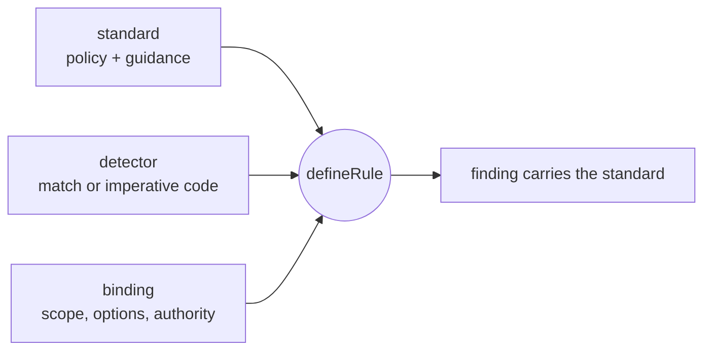
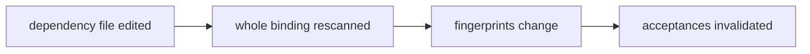

# Write rules

**A rule is three parts you own: a revisioned standard, a versioned detector, and a repository binding. A pattern rule is about twenty lines; review it like any code.**



| Part       | What it is                                                     | Versioned by            |
| ---------- | -------------------------------------------------------------- | ----------------------- |
| `standard` | Durable, revisioned policy and guidance                        | `revision`              |
| `detector` | Versioned trigger: a `match` pattern or imperative code        | `version`               |
| `binding`  | Repository-owned scope, options, and `agent`/`human` authority | material binding digest |

| Lifecycle | Judges                        | Evidence                                                                  |
| --------- | ----------------------------- | ------------------------------------------------------------------------- |
| `state`   | Current repository structure  | Parsed files: JavaScript, TypeScript, TSX, JSON                           |
| `change`  | The operation, not the result | Normalized before/after Git evidence, merge base to complete working tree |

The standard travels with every finding: its text, checks, and permitted examples. The agent doesn't rely on recall.

One standard can have several detectors, one rule each. Share one `standard` object between them: config loading rejects two rules whose standards share an id but differ in content.

## A state rule is a code shape plus a standard

```ts
import { defineConfig, defineRule } from "@aurelienbbn/agentlint";

const boundedReads = defineRule({
  lifecycle: "state",
  standard: {
    id: "data/bounded-reads",
    revision: 1,
    title: "Production reads are bounded",
    guidance: {
      standard: "Reads that scale with production data have an explicit bound or pagination contract.",
      checks: ["A hard limit, cursor, or proven finite dataset can satisfy the standard."],
      examples: [{ label: "Explicit bound", code: "db.users.findMany({ take: 50 })" }],
    },
  },
  detector: {
    id: "prisma/find-many-without-take",
    version: 1,
    match: {
      pattern: "$DB.findMany($$$ARGS)", //  parsed code shape, not text
      where: { notHas: "take: $_" },
      message: "$DB has no explicit bound.",
    },
    fixtures: {
      mustReport: ["db.users.findMany({})"], //                proves activation
      mustStaySilent: ["db.users.findMany({ take: 50 })"], //  protects a boundary
    },
  },
  binding: {
    id: "data/bounded-reads",
    authority: "agent", //  or "human"
    reviewEpoch: 1, //      optional; bump to force re-review
    include: ["src/**/*.ts"],
    exclude: ["**/*.test.ts"],
  },
});

export default defineConfig({ rules: [boundedReads] });
```

`authority` decides who may close a finding and `reviewEpoch` forces fresh review; both are covered in [Acceptance](acceptance.md).

## Patterns match parsed code, not text

| Syntax                             | Meaning                                                                        |
| ---------------------------------- | ------------------------------------------------------------------------------ |
| `$NAME` / `$_`                     | One node, captured / not captured                                              |
| `$$$ARGS`                          | Zero or more remaining sibling nodes                                           |
| `$A === $A`                        | Repeats must capture the same code: matches `x === x`, not `x === y`           |
| `where`                            | Searches inside the matched code                                               |
| `take: $_`                         | Also matches shorthand `{ take }`; never looks inside another property's value |
| `query` + `@match`                 | Raw tree-sitter query; `@match` names the reported node                        |
| `createOnce({ context, options })` | Imperative escape hatch for stateful or repository-wide detectors              |

Several matches of one rule on the same node report once, under the first declared match.

## Fixtures prove activation and protect boundaries

| Fixture          | Proves                               |
| ---------------- | ------------------------------------ |
| `mustReport`     | The detector activates               |
| `mustStaySilent` | A valuable boundary stays unreported |

- Fixtures are focused evidence, not an exhaustive list of every possible mistake.
- Their code is never sent to the agent as guidance.
- `agentlint rules test` runs every rule against its fixtures. It replays them and rejects differing findings, which catches nondeterministic imperative detectors.
- Fixtures test activation. Calibrate file scope against the repository with [`rules scan`](calibration.md).
- Promise-based helpers for your own test runner live in [`@aurelienbbn/agentlint/testing`](api.md#testing-helpers).

## A change rule judges the operation, not the result

```ts
const destructiveMigration = defineRule({
  lifecycle: "change",
  standard: {
    id: "database/destructive-migrations",
    revision: 1,
    title: "Destructive schema changes receive human review",
    guidance: {
      standard: "A destructive migration includes a verified backfill, rollback, and deployment sequence.",
      examples: [{ code: "// Expand, backfill, verify, then contract in a later deployment." }],
    },
  },
  detector: {
    id: "sql/destructive-operation",
    version: 1,
    detect({ context }) {
      for (const file of context.change.files) {
        for (const hunk of file.hunks) {
          const destructive = hunk.lines.find(
            (line) => line.kind === "addition" && /drop\s+(table|column)/i.test(line.content),
          );
          if (!destructive) continue;
          context.report({
            key: `${file.path}:destructive-schema`,
            lineageKey: `${file.path}:destructive-schema`,
            file: file.path,
            message: "This change introduces a destructive schema operation.",
            evidence: { operation: destructive.content.trim() }, // material: changing it invalidates acceptance
            excerpt: destructive.content,
            startLine: hunk.newStart,
          });
        }
      }
    },
    fixtures: {
      mustReport: [{ before: {}, after: { "migration.sql": "DROP TABLE legacy_users;" } }],
      mustStaySilent: [{ before: {}, after: { "migration.sql": "CREATE TABLE users (id int);" } }],
    },
  },
  binding: { id: "database/destructive-migrations", authority: "human", include: ["migrations/**"] },
});
```

Evidence runs from the selected ref's merge base to the current working tree: committed branch changes, staged and unstaged edits, renames, deletions, and untracked files. Change detectors also consume Git evidence for file types state parsing doesn't support.

Without `--base <ref>`, agentlint detects an upstream or conventional main branch, and fails clearly if no valid base exists.

## Imperative detectors are trusted code with a synchronous contract

Repository-authored imperative detectors run as trusted code. They must report synchronously and keep their findings stable.

| Contract                           | Rule                                                                                                      |
| ---------------------------------- | --------------------------------------------------------------------------------------------------------- |
| Scan unit (state)                  | Repository scan by default. A detector independent for each file can declare `scan: "file"`.              |
| Node wrappers                      | Valid only during their file visitor. In `after()`, keep captured plain data, not syntax nodes.           |
| `context.report({ key })`          | Unique, stable, non-empty                                                                                 |
| `context.report({ evidence })`     | Optional material JSON. Changing it invalidates acceptance; change detectors own their material evidence. |
| `context.report({ relatedFiles })` | State: drawn from declared `binding.dependencies`. Change: drawn from the normalized change set.          |
| Hooks                              | Return synchronously. A returned promise fails the rule.                                                  |

Breaking the reporting contract (duplicate or empty key, evidence outside the change set, undeclared related context) or returning a promise from a hook fails the rule with a `DetectorContractError` cause.

Related sources travel with review artifacts as collapsible reading context. They aren't material unless the detector also reports them in `evidence`.

## Dependencies make another file part of the justification

`binding.dependencies` (state rules only) lists exact normalized repository-relative paths a justification relies on, for example `["src/http/pagination.ts"]`.



- Paths, not globs. Each is a required input.
- Contents are available to the detector as `context.dependencies[path]`. Include them in repository fixtures too.
- A dependency change rescans the whole binding, even when the matched file didn't change.
- No runtime or transitive dependency inference.
- Change rules reject `binding.dependencies`; they report supporting evidence through `report({ evidence })`.

## Sources and references never change what matches

| Field                    | Accepts                                             | Role                                                                  |
| ------------------------ | --------------------------------------------------- | --------------------------------------------------------------------- |
| `standard.source`        | `{ type: "url", href }` or `{ type: "file", path }` | Why the standard exists. Provenance only; never changes what matches. |
| `standard.guidance.refs` | `{ type: "url", href }` or `{ type: "skill", id }`  | Help for the judgment. Never activates a rule or opens a gate.        |

The review UI opens safe HTTP(S) references in a new tab. File sources and skill ids stay typed targets in copied finding context; the browser doesn't pretend to resolve them. That keeps the contract useful to agents without turning an unresolved identifier into a broken link.

## Next

- [Acceptance](acceptance.md): who may close a finding and what reopens it.
- [Calibration](calibration.md): measure a rule on real code before it gates.
- [Public API](api.md): every export, type, and error.
