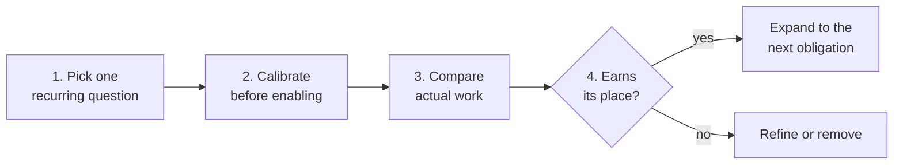

# Validate a review obligation

A worksheet for one developer or a small team to prove a rule earns its place. Keep the evidence in your repository or normal review notes; the engine needs no telemetry.



## 1. Pick one recurring question

Start with a real correction. If the answer is mechanically decidable, prefer a test, a type, or a conventional lint check.

- Original review comment or required decision:
- Repository standard and permitted cases:
- Deterministic trigger and files in scope:
- Authority required:
- Supporting files that must invalidate a decision when changed:
- Rule owner:

## 2. Calibrate before enabling

1. Write one rule with focused activation and silence fixtures.
2. Add fixtures that change a guard, a supporting file, a duplicate occurrence, and formatting.
3. Run `agentlint rules test` and `agentlint rules scan --review`.
4. Examine every match. Refine or remove an unreliable trigger before enabling it.
5. Commit the rule and explain its scope to the other developers.

## 3. Compare actual work

Run representative tasks three ways: normal repository instructions, explicitly surfaced standards, and the acceptance gate. Use comparable tasks or replayable task snapshots. A developer assesses the results; an agent's acceptance is not proof of correctness.

| Task | Setup | Missed concerns | Useful interceptions | Unnecessary reviews | Human review minutes | Rule maintenance minutes |
| ---- | ----- | --------------- | -------------------- | ------------------- | -------------------- | ------------------------ |
|      |       |                 |                      |                     |                      |                          |

- Include the cost of initial rule authoring and repeated invalidations.
- Count a stored acceptance as a decision, not as a prevented defect.

Record delayed evidence against the current finding, using a commit, issue, or incident identifier as the reference:

```bash
agentlint outcomes record <selector> --kind <kind> --reference <id> --note "<what it taught>"
```

Kinds: `useful_interception`, `unnecessary_review`, `escaped_concern`, `corrective_change`, `rollback`, `incident`.

An outcome is observational. It does not retroactively prove the original acceptance right or wrong.

## 4. Decide whether the rule earns its place

- Which obligation became reliably visible?
- Which decisions saved a repeated discussion?
- Did total review and maintenance effort decrease?
- Did an acceptance survive a change that should have invalidated it?
- Did a harmless change cause excessive review work?
- Keep, refine, or remove the rule, with a short reason.

If a policy period or architectural assumption changed independently of source evidence, increment the binding's repository-controlled `reviewEpoch` and review the resulting invalidations. Don't bump it as a scheduled ritual with no concrete reason.

Expand only after this evidence shows the first obligation is useful. The same process works for a personal rule and for a shared team standard.
