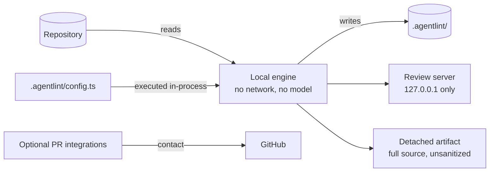
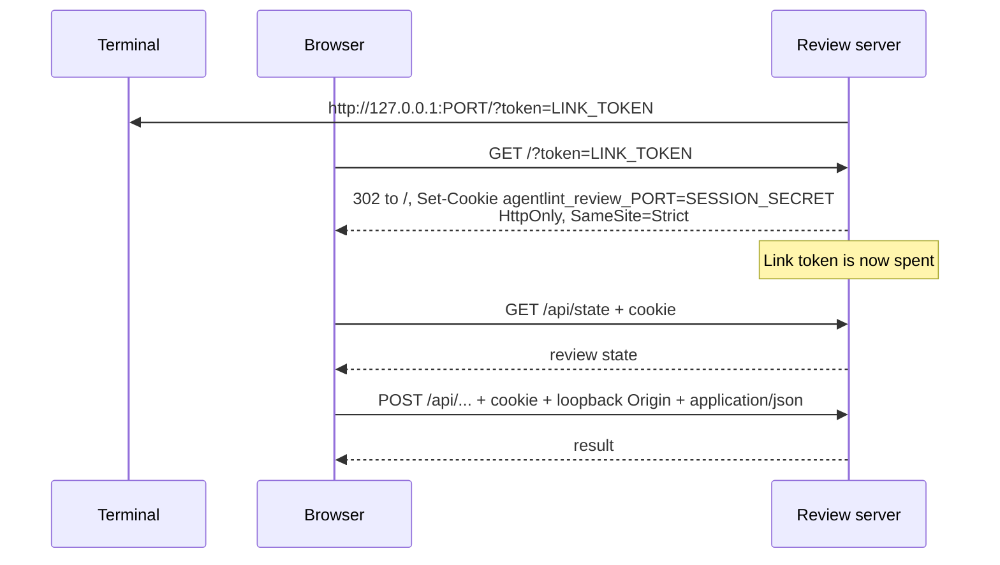

# Security model

These boundaries are precise enough to drift with the implementation. [`SECURITY.md`](../SECURITY.md) covers supported versions and private vulnerability reporting.

## The engine is offline, but rules are code

- **Offline engine.** It reads the repository, runs repository-selected detectors in-process, and writes to `.agentlint/`. No network requests, no model. Optional pull-request integrations contact GitHub.
- **Rules are code.** `.agentlint/config.ts` is loaded and evaluated. Run untrusted pull-request configuration like any untrusted dependency: on an isolated runner without secrets or a write token. The bundled action rejects `pull_request_target`.
- **Authority is accountability, not cryptographic identity.** Any process with repository write access can edit the configuration and acceptance store. Git review is the intended control.

## Local review server

`agentlint review` binds to `127.0.0.1` and advertises `http://127.0.0.1:<port>`. A one-time link becomes a session cookie:

The session secret is a different random value from the link token. Reusing the link without the cookie is refused; a browser that already holds the cookie may revisit it.

The server answers each request by these rules:

| Request                | Required                                                                       | Otherwise                                                        |
| ---------------------- | ------------------------------------------------------------------------------ | ---------------------------------------------------------------- |
| Any                    | `Host` is `127.0.0.1:<port>` or `localhost:<port>`                             | 403                                                              |
| `/api/*`               | The session cookie                                                             | 403                                                              |
| `/api/*` read          | The browser does not identify it as cross-site or same-site (`Sec-Fetch-Site`) | 403                                                              |
| `/api/*` mutation      | A loopback `Origin`                                                            | 403                                                              |
| Mutation with a body   | `application/json`, at most 128 KiB                                            | 415 or 413                                                       |
| Any unexpected failure | —                                                                              | Detail logged to the terminal; fixed public error to the browser |

> [!WARNING]
> Two things stay visible to other processes on the same machine: the static SPA shell, and the link token until its first use (in the terminal and in the browser launcher's arguments).

### Editor launches stay inside the repository

- The target file must resolve inside the repository.
- Launchers are limited to registered URL schemes, or commands discovered on `PATH` whose resolved executable is outside the reviewed repository.

## Detached artifacts are not sanitized

Detached review artifacts contain full source files, findings, standards, and recorded reasons. Source and reasons can contain secrets. Apply the repository's confidentiality and retention policy to them.

A review server opened on an artifact (`agentlint review --from`) refuses repository actions and editor launches.
