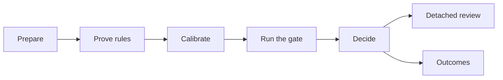

# agentlint demo

A small commerce app that runs the whole loop. The package supplies the engine and review tools; this repository supplies every rule, in [`.agentlint/config.ts`](.agentlint/config.ts).

| Rule                               | Lifecycle | Who may accept |
| ---------------------------------- | --------- | -------------- |
| `data/bounded-queries`             | state     | agent          |
| `payments/idempotent-capture`      | state     | agent          |
| `testing/no-focused-tests`         | state     | agent          |
| `security/dynamic-code-execution`  | state     | human          |
| `privacy/customer-data-exports`    | state     | human          |
| `database/destructive-migrations`  | change    | human          |
| `authorization/privilege-widening` | change    | human          |

The seeded state also has related reading context, dense rule groups, accepted work, an invalidated prior judgment, and delayed outcome evidence.



## Prepare

```bash
pnpm install
pnpm build
cd examples/demo
```

Every command below runs through `pnpm agentlint`, which points at the workspace build.

## Prove the rules

```bash
pnpm agentlint rules test
```

Each detector's `mustReport` and `mustStaySilent` fixtures define its detection boundary, not a list of every bad program.

## Calibrate before enforcing

```bash
pnpm agentlint rules scan --rule data/bounded-queries --review
```

Label each match applies, does not apply, or unsure. Refine the detector, binding, guidance, and fixtures from the labels, then run `rules test` again. Labels are temporary: they never accept a finding and never change the gate.

## Run the gate

```bash
pnpm agentlint check --all --base origin/main
```

The queue spans API, background job, payment, test, privacy, and vendored code. Three seeded situations show what the review workspace is for:

- **A finding needs repository context.** `customer-export.ts` links directly to the written customer-data export contract so the human reviews code and policy together.
- **An agent could not fix it.** `legacy-parser.js` calls `eval` in vendored code. The agent recorded a proposal without a diff explaining why it needs a product decision.
- **An agent already decided.** `reconcile-orders.ts` has a bounded-query finding the agent accepted with a concrete reason. It appears in **Decisions** with actor and time, where a human can request a correction.

## Decide

In the terminal, with the selector printed by your latest check:

```bash
pnpm agentlint explain <selector>
pnpm agentlint accept <selector> --reason "The endpoint has a verified finite tenant bound."
pnpm agentlint approve <selector> --reason "The requested fields and authorization path satisfy the linked privacy contract."
```

`accept` cannot accept a human-authority finding; `approve` records human authority.

Or in the review workspace (`?` lists keyboard shortcuts):

```bash
pnpm agentlint review --base origin/main
```

| Screen    | Shows                                                                             |
| --------- | --------------------------------------------------------------------------------- |
| Queue     | Undecided findings by file, with the code, the standard, and the agent's proposal |
| Decisions | Accepted findings, by whom and when                                               |
| Final     | A copyable handoff for the coding agent                                           |

### QA a multi-file finding

Open **Customer-data exports follow the repository privacy contract**. Under **Related review context**, expand `policy/customer-data-exports.md` (the written policy) and `src/contracts/customer-data-export.ts` (the executable field contract) to read them beside the primary finding.

The rule lists both files in `dependencies` and in `relatedFiles` on purpose: dependencies participate in finding identity; `relatedFiles` selects the sources the reviewer sees.

The binding also sets `reviewEpoch: 1`. Increment it only to make every otherwise-compatible decision for this rule be revisited; the next review then explains that the repository advanced the epoch.

## Detached review

```bash
pnpm agentlint check --all --base origin/main --review-output agentlint-review.json
pnpm agentlint review --from agentlint-review.json
pnpm agentlint acceptances import agentlint-acceptances.jsonl --base origin/main
```

Detached review never writes to the repository. Import recomputes current findings and rejects stale or incompatible records.

## Acceptance lifetime

| Acceptance | Kept through                                                       | Invalidated by         |
| ---------- | ------------------------------------------------------------------ | ---------------------- |
| State      | A formatting-only edit                                             | A material syntax edit |
| Change     | Nothing: valid only for its exact versioned Git-change fingerprint | Any other Git change   |

`check --all` removes dead acceptance records. `.agentlint/acceptances.jsonl` holds only current accepted results; Git holds the history.

## Inspect delayed outcomes

`.agentlint/outcomes.jsonl` holds committed observations of what happened after earlier findings:

```bash
pnpm agentlint outcomes list
pnpm agentlint outcomes list --format json
```

Add one for a current finding by its queue selector:

```bash
pnpm agentlint outcomes record 1 --kind useful_interception --reference "issue:DEMO-101" \
  --note "The review caught an export field that was outside the privacy contract."
```

Outcomes are evidence for later rule calibration. They never accept a finding or change the gate.
